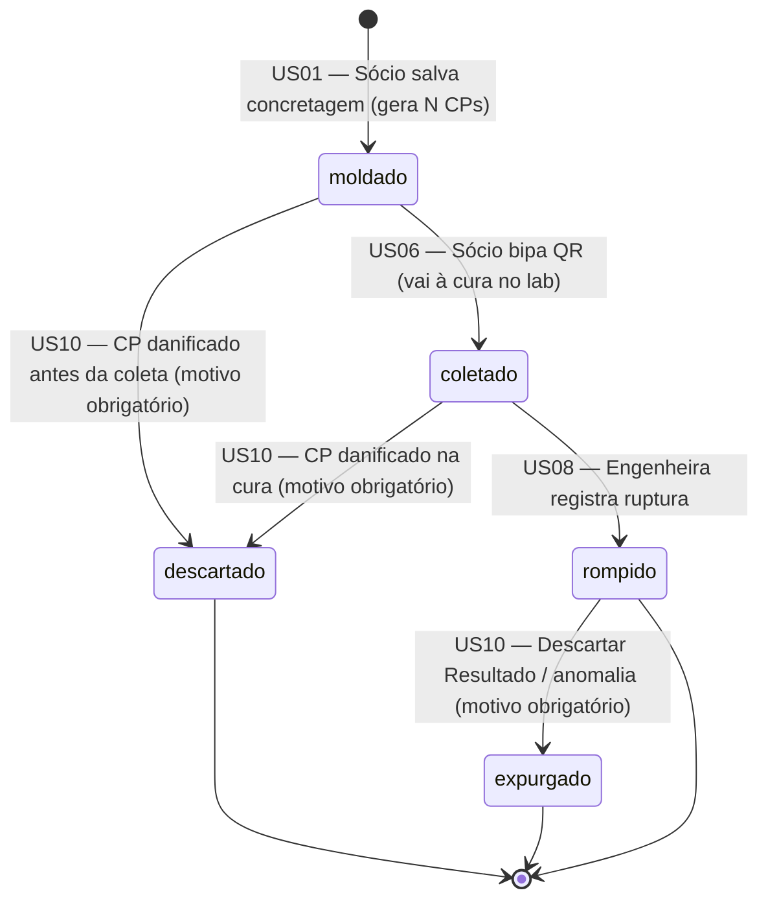
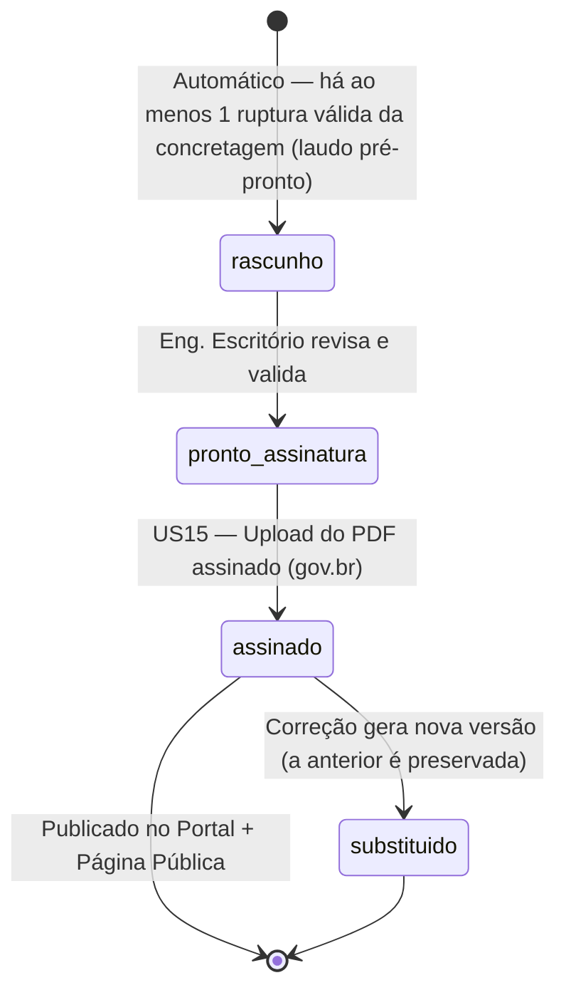

# Product Requirements Document (PRD) - MVP Laboratório de Concreto

> **Versão:** 2.0 — Consolidada com as respostas da engenheira (25 perguntas de validação) e resolução formal dos 7 Gaps Críticos apontados em [revisao_critica_prd.md](./revisao_critica_prd.md).
> **Data:** 03/07/2026
> **Documento de referência de layout de laudo:** `c36756fc-001_ENSAIO_7_DIAS_REBRASCOM_assinado.pdf` (exemplo real fornecido pela engenheira).

---

## 1. Visão Geral e Objetivo

Este documento define os requisitos do Produto Mínimo Viável (MVP) do aplicativo para Controle Tecnológico de Concreto. O objetivo principal é eliminar gargalos operacionais da equipe, desde a coleta em campo (rastreabilidade e automação de dados) até o rompimento na prensa e a emissão segura do laudo final para o cliente.

O laudo emitido tem **validade técnica e jurídica** (ensaio de compressão conforme ABNT NBR 5739, assinado por engenheiro com registro no CREA). Por essa razão, **rastreabilidade, retenção vitalícia de dados e proteção anti-fraude** são requisitos de primeira classe, e não meros "nice-to-have".

### 1.1. Índice de Resolução dos 7 Gaps Críticos

| # | Gap Crítico | Onde é resolvido neste PRD |
|---|---|---|
| 1 | Ausência de Critérios de Aceite | Seção 8 — Critérios de Aceite (`Dado/Quando/Então`) em **todas** as User Stories |
| 2 | Modelo de Permissões (RBAC) indefinido | Seção 3 — Personas e **Matriz RBAC** (Role × Recurso × Ação) |
| 3 | Audit Trail ausente | Seção 9 — Política de Auditoria e Rastreabilidade + tabela `audit_log` |
| 4 | Máquina de estados não definida | Seção 5 — Máquinas de Estado (Corpo de Prova e Laudo) |
| 5 | Referência a normas incompleta | Seção 6 — Normas Técnicas de Referência |
| 6 | Fórmula kgf → MPa não especificada | Seção 7 — Cálculos de Engenharia (fórmula, unidades, arredondamento, validações) |
| 7 | Cadastro de Obras ausente | Seção 8 — US20/US21 (CRUD de Obras) + Matriz RBAC |

---

## 2. Decisões de Regras de Negócio e Casos de Borda

Seguindo a premissa de **simplicidade, mudanças cirúrgicas e foco na entrega**, e agora consolidadas com as respostas da engenheira responsável:

### 2.1. Fluxo de Moldagem e Corpos de Prova (CPs)
* **Quantidade de CPs e idades — TOTALMENTE CONFIGURÁVEL (sem padrão fixo):** O sócio/moldador define, a cada concretagem, **quantos** CPs serão moldados e a **idade-alvo de ruptura de cada um** (ex.: 7, 14, 28 dias — mas também 3, 63, 91 dias, se necessário). O sistema **não** impõe um número fixo. Para agilidade, a tela oferece atalhos rápidos (ex.: "2×7d + 2×14d + 2×28d", "2×7d + 2×28d"), mas nenhum é obrigatório. O número de etiquetas impressas e a agenda de coletas/rompimentos derivam **dinamicamente** dessa configuração.
* **CPs mandatórios de 28 dias:** Ao romper CPs antecipadamente (ver 2.2), o sistema deve **preservar** os 2 CPs de maior idade-alvo (tipicamente 28 dias) obrigatórios pela norma, alertando a engenheira caso ela tente rompê-los antes da idade.
* **Slump Test:** O slump **não** possui faixa de tolerância derivada do fck. O valor-alvo e a tolerância são **definidos em projeto** (ex.: "12 ± 2"). O sistema armazena `slump_projeto` e `slump_tolerancia` (informados na concretagem) e valida o `slump_medido` contra essa faixa. Fora da faixa ⇒ **aviso não bloqueante** + ressalva textual no laudo (não é bloqueio, pois a decisão de liberação é do sócio em campo).
* **Slump Test Reprovado:** O sistema só registra concretagens **aprovadas** e moldadas. Não há controle de devolução de caminhões.
* **Perda ou Quebra de CPs:** Não há "CPs Reserva". CP danificado antes do ensaio ⇒ status **`descartado`** (com motivo obrigatório). O laudo calcula a média (MPa) apenas com os CPs válidos restantes.
* **Registro de entrada no laboratório:** **NÃO existe** um registro de entrada separado. O CP é identificado na obra (na moldagem, com etiqueta QR Code impressa). Ao chegar ao laboratório, vai direto ao tanque de cura. A **coleta (US06)** — bipagem do QR — é suficiente para rastrear que o CP está em cura. O estado `coletado` significa, na prática, "em cura no laboratório".

### 2.2. Fluxo de Prensa (Ruptura)
* **Fila de rompimento:** Não há fila formal. A engenheira seleciona **todos** os CPs que atingiram a idade no dia e rompe todos (demanda baixa). CPs de **clientes diferentes podem ser misturados** no mesmo dia de rompimento.
* **Cálculo com diâmetro NOMINAL:** O MPa é calculado com o **diâmetro nominal** do CP (ex.: 100 mm para molde 100×200; 150 mm para molde 150×300), **não** com o diâmetro medido. As dimensões reais (peso, diâmetro e altura medidos com paquímetro) **são registradas** para rastreabilidade e para uso futuro do fator de correção h/d quando a **retífica** for plenamente adotada (ver Seção 6). Ver fórmula na Seção 7.
* **Ruptura Inválida (Erro na Prensa) / Descarte de Resultado:** A tela da prensa terá o botão "Descartar Resultado", que marca o CP como **`expurgado`** (a leitura de MPa é excluída da média) — com **motivo obrigatório**. Difere de `descartado`: o CP `expurgado` chegou a ser rompido, mas seu resultado foi anulado.
* **Idade de todos descartados/expurgados = "Expurgado":** Se **todos** os CPs de uma mesma idade forem descartados/expurgados, aquela idade fica sem resultado válido; o laudo daquela idade **não é emitido** e a idade é sinalizada como expurgada.
* **Tipos de fratura (nomenclatura própria do laboratório):** O laboratório usa uma nomenclatura didática própria (mapeável à NBR 5739). A US09 usa **estes** rótulos:
  1. Ruptura de Cabeça
  2. Ruptura de Face
  3. Ruptura Parcial
  4. Ruptura Total
  5. Ruptura de Cisalhamento
  6. Ruptura de Trinca

### 2.3. Laudo
* **Escopo padrão — 1 laudo por NF:** Por padrão, é gerado **um laudo por Nota Fiscal (concretagem)**. O sistema também permite, **opcionalmente**, **agrupar manualmente várias NFs da mesma obra** em um único laudo consolidado (como no PDF de exemplo, que reúne 4 NFs da obra AGEHAB).
* **Laudo Parcial vs. Final:**
  * O **laudo parcial** (7d / 14d) é enviado ao cliente **apenas quando solicitado**.
  * Na maioria dos casos, envia-se **um único laudo final (28 dias)** que consolida **todos os resultados (7, 14 e 28 dias)** em um só documento, com o gráfico de análise de crescimento.
* **Correção/Retificação — versionamento obrigatório:** Ao corrigir um laudo já emitido, a versão anterior é **preservada** com status `substituido`, e uma **nova versão** é gerada (número de versão incrementado). A página pública (US19) sempre exibe a **versão vigente** (mais recente não substituída). *(Isso eleva a prática atual — que era sobrescrever o PDF — ao padrão exigido por um documento jurídico com retenção vitalícia.)*
* **Numeração sequencial controlada:** Cada laudo tem um número/código controlado. A regra varia por cliente:
  * **Cliente fixo (concreteira):** sequência numérica própria; historicamente passou a usar o **número da NF** como identificador.
  * **Demais clientes (esporádicos):** código padronizado `CT{nº-contrato}-T{traço}-CP{n}` (ex.: `CT001-T2-CP1`), onde o número refere-se ao contrato e `T` ao traço.
  * O identificador do laudo combina um **nº sequencial + identificação da obra** (ex.: `N°003AGEHAB`).
  * **Quem controla:** o **sócio/moldador** (quem molda os CPs) mantém e organiza a sequência; ela já chega organizada no momento da geração do laudo.
* **Assinatura:** **Uma** assinatura (da Responsável Técnica, via gov.br/PAdES) é **suficiente** para publicar o laudo ao cliente. O sistema **suporta uma segunda assinatura opcional** (do engenheiro elaborador), pois ambos os engenheiros têm responsabilidade e podem assinar de **qualquer lugar/dispositivo**.

### 2.4. Arquitetura, UX e Tratamento de Erros
* **Modo Offline:** Estritamente **fora do escopo**. O app exige internet. Sem sinal na obra, o operador tira fotos comuns e cadastra depois, quando houver conexão.
* **Falha no OCR (IA):** Fluxo `Foto → Processamento IA → Formulário Preenchido`. O usuário **sempre** revisa e clica em "Salvar". Campo com baixa confiança é destacado (amarelo). Botão "Preenchimento Manual" para pular a foto se a API estiver indisponível. Limites de erro/timeout na Seção 8 (US01).
* **Impressão Bluetooth:** A etiqueta contém QR Code + texto legível (Sigla da Obra, Data, Idade-Alvo e ID). As etiquetas devem resistir à submersão no tanque de cura por até 28 dias. Botão "Reimprimir Etiqueta" no histórico.
* **Assinatura Gov.br:** Processo **manual**. Web permite "Baixar Laudo (PDF)" e, após assinatura externa, "Upload do Laudo Assinado". Automação via API do governo fica para o futuro.
* **Fotos de evidência (Antes/Depois):** **Nunca** aparecem no laudo do cliente nem são compartilhadas com ele (podem gerar prova/argumento contra o laboratório). São arquivadas internamente (substituindo o fluxo atual via grupo de WhatsApp) e devem ser **enviadas diretamente do app para o Storage**, sem a etapa manual de transferir do WhatsApp para o computador. Ficam disponíveis apenas internamente, em um anexo técnico, para auditorias/disputas.

### 2.5. Escopo Excluído (Fora do MVP)
* Notificações Push nativas (substituídas por envio automático de e-mail).
* Módulo financeiro/bloqueio por falta de pagamento.
* Gestão e rastreabilidade física de moldes.
* Painel de auto-cadastro para clientes (cadastro é interno, feito pelo laboratório).
* Integração automática com a API gov.br para assinatura.
* Fator de correção h/d na prensa (planejado para quando a retífica for plenamente adotada — ver Seção 6).
* Esclerometria (NBR 7584) — sistema deve permanecer extensível a ela.
* Certificação/acreditação ISO 9001 e ISO/IEC 17025 — o laboratório **não** as possui; o sistema segue **boas práticas de auditoria** para ser extensível a elas no futuro.

---

## 3. Personas, Papéis e Modelo de Acesso (RBAC) — *Resolve o Gap 2*

### 3.1. Personas Reais
O laboratório tem **dois sócios** (um terceiro faleceu; não há necessidade de múltiplos coletores simultâneos):

| Papel (role) | Pessoa/Descrição | Plataforma | É admin? |
|---|---|---|---|
| `socio_campo` (Moldador) | Faz Slump Test, molda CPs, imprime etiquetas, coleta CPs, cria obras e **controla a numeração dos laudos**. | Mobile (e Web se quiser) | Não |
| `eng_lab` (Engenheira sócia-proprietária / RT-CREA) | Faz os rompimentos na prensa, descarta/expurga CPs, **assina** os laudos (RT). Gerencia usuários. | Mobile + Web | **Sim** |
| `eng_escritorio` (Engenheiro sócio — elaborador) | Edita concretagens, gera/revisa laudos, pode assinar (2ª assinatura). Gerencia usuários. | Web (e Mobile se quiser) | **Sim** |
| `cliente` | Acessa o portal, vê e baixa apenas os laudos de suas obras. | Web | Não |

**Login multiplataforma (resposta P18):** Todos os perfis internos podem logar **tanto no mobile quanto no web**, de qualquer lugar — não há restrição de plataforma por perfil. Deve-se facilitar o acesso, pois nem sempre estarão no escritório.

**Gestão de usuários (resposta P16):** **Somente** `eng_lab` e `eng_escritorio` (os dois sócios/admins) podem cadastrar usuários e clientes. O `socio_campo` **não** gerencia usuários.

### 3.2. Matriz de Permissões RBAC (Role × Recurso × Ação)

Legenda: ✅ permitido · ⛔ negado · 🔒 escopo restrito (apenas registros vinculados ao próprio cliente).

| Recurso / Ação | `socio_campo` | `eng_lab` (RT, admin) | `eng_escritorio` (admin) | `cliente` |
|---|:---:|:---:|:---:|:---:|
| **Usuários** — criar/editar/desativar | ⛔ | ✅ | ✅ | ⛔ |
| **Clientes** — CRUD | ⛔ | ✅ | ✅ | ⛔ |
| **Obras** — criar | ✅ | ✅ | ✅ | ⛔ |
| **Obras** — editar/inativar | ✅ (que criou) | ✅ | ✅ | ⛔ |
| **Concretagens** — criar (campo) | ✅ | ✅ | ✅ | ⛔ |
| **Concretagens** — editar | ⛔ (após salvar) | ✅ | ✅ | ⛔ |
| **Concretagens** — visualizar | ✅ (as suas) | ✅ | ✅ | ⛔ |
| **Corpos de Prova** — gerar/etiquetar | ✅ | ✅ | ✅ | ⛔ |
| **Corpos de Prova** — marcar coletado | ✅ | ✅ | ⛔ | ⛔ |
| **Corpos de Prova** — descartar (pré-ensaio) | ⛔ | ✅ | ⛔ | ⛔ |
| **Rupturas** — registrar (prensa) | ⛔ | ✅ | ⛔ | ⛔ |
| **Rupturas** — expurgar resultado | ⛔ | ✅ | ⛔ | ⛔ |
| **Fotos de evidência** — enviar/ver | ⛔ | ✅ | ✅ | ⛔ |
| **Laudos** — gerar/editar rascunho | ⛔ | ✅ | ✅ | ⛔ |
| **Laudos** — gerar PDF | ⛔ | ✅ | ✅ | ⛔ |
| **Laudos** — upload do PDF assinado | ⛔ | ✅ | ✅ | ⛔ |
| **Laudos** — corrigir (nova versão) | ⛔ | ✅ | ✅ | ⛔ |
| **Laudos** — visualizar/baixar | ⛔ | ✅ | ✅ | 🔒 (só os seus) |
| **Página pública de validação** | pública | pública | pública | pública |
| **Exportação Excel (concreteiras)** | ⛔ | ✅ | ✅ | ⛔ |
| **audit_log** — leitura | ⛔ | ✅ | ✅ | ⛔ |

> **Nota RLS (Supabase):** As linhas `cliente` são filtradas por `cliente_id`. A página pública de validação (US19) é a única superfície sem login e deve expor **somente** um endpoint read-only por `codigo_verificacao`.

---

## 4. Requisitos Não-Funcionais

1. **Segurança do PDF:** O laudo final é gerado (via Edge Function) com restrições de permissão (somente-leitura, sem cópia de texto — `ReadOnly=true, AllowPrinting=true, AllowCopy=false`).
2. **Confiabilidade anti-fraude:** O QR Code de verificação não requer login — URL pública e imutável atrelada a um `codigo_verificacao` (hash único) no banco.
3. **Disponibilidade / Ergonomia:** A tela de prensa (mobile) deve ter botões grandes e de alto contraste (uso com luvas/mãos sujas).
4. **Retenção vitalícia (resposta P22):** Laudos e dados de ensaio devem ser armazenados de forma **vitalícia** (documento potencialmente jurídico). Não há expurgo automático de dados de laudo.
5. **Criptografia:** Dados em trânsito via HTTPS/TLS e em repouso (recurso nativo do Supabase), explicitamente exigidos.
6. **Tecnologias:**
   * Mobile: React Native + Expo (TypeScript).
   * Web: React + Vite + Tailwind CSS.
   * Backend: Supabase (Postgres, Auth, Storage, Edge Functions).
   * IA / OCR: GPT-4o-mini Vision via Edge Function.

---

## 5. Máquinas de Estado — *Resolve o Gap 4*

### 5.1. Corpo de Prova (`corpos_prova.status`)

Estados: `moldado | coletado | rompido | descartado | expurgado`.



**Guardas (condições) das transições:**
* `coletado → rompido`: recomendado somente após atingir a idade-alvo (`hoje ≥ data_moldagem + idade_alvo_dias`). Ruptura antecipada é **permitida** (aviso), **exceto** para os 2 CPs de maior idade obrigatórios (28d), que o sistema **impede** de romper antes da idade.
* `* → descartado` e `rompido → expurgado`: exigem `motivo` (texto) e geram registro de auditoria (Seção 9).
* Estados `descartado` e `expurgado` **removem o CP da média** do laudo. Se **todos** os CPs de uma idade caírem nesses estados, a idade fica "sem resultado válido" e o laudo daquela idade não é emitido.

### 5.2. Laudo (`laudos.status`)

Estados: `rascunho | pronto_assinatura | assinado | substituido`.



**Guardas:**
* `rascunho → pronto_assinatura`: todos os CPs das idades cobertas pelo laudo devem estar em estado terminal (`rompido`, `descartado` ou `expurgado`) — sem CPs pendentes.
* `pronto_assinatura → assinado`: **é obrigatório** existir o `pdf_assinado_url` (não se marca "assinado" sem o upload do PDF). **Uma** assinatura (RT) basta; a 2ª (elaborador) é opcional (campos separados).
* `assinado → substituido`: a nova versão referencia a anterior (`substitui_laudo_id`). A **página pública sempre resolve para a versão vigente** (não substituída).

---

## 6. Normas Técnicas de Referência — *Resolve o Gap 5*

| Norma | Papel no sistema | Cobertura no MVP |
|---|---|---|
| **NBR 5738** — Moldagem e cura de CPs | Nº de CPs por idade (configurável), datas de moldagem/cura, prazo de coleta (24h). | ✅ Coberta |
| **NBR 5739** — Ensaio de compressão | Cálculo de resistência (MPa) e classificação de fratura (nomenclatura própria do lab, mapeável à norma). Base do laudo. | ✅ Coberta |
| **NBR 12655** — Preparo, controle e recebimento do concreto | Referência conceitual. O **fck NÃO é calculado** pelo sistema: vem do projeto/NF e é transcrito ao laudo. Projeção 7/14→28d por fatores percentuais fixos (ver 6.2). | ✅ Coberta (ver 6.2) |
| **NBR NM 67** — Slump Test (abatimento) | Registro do `slump_medido` e validação contra o slump de **projeto ± tolerância** (não por fck). | ✅ Coberta |
| **NBR 7584** — Esclerometria (dureza superficial) | Fora do MVP; a modelagem deve permanecer **extensível** a novos tipos de ensaio. | ⛔ Fora do MVP (extensível) |

### 6.1. Fator de correção h/d
Atualmente **não aplicado** (CPs padronizados, formas íntegras, relação h/d = 2 mantida). O laboratório **iniciou o uso de retífica**; o fator de correção h/d será adicionado **quando a retífica for plenamente adotada**. A modelagem deve reservar espaço para um fator de correção configurável (default = 1,00).

### 6.2. fck e projeção para 28 dias
* **fck — NÃO é calculado pelo sistema (dado capturado):** O fck é **definido em projeto** pelo engenheiro projetista, informado pelo cliente à concreteira e **emitido na Nota Fiscal**. O laboratório apenas **captura esse valor da NF** (via OCR — US01) e o **transcreve para o laudo** ("FCK especificado"). Portanto, o sistema **não** executa o cálculo estatístico da NBR 12655 (ψ6/amostragem parcial): o fck é um **dado**, não um cálculo. *(Confirmado pela engenheira.)*
* **Projeção (majoração) para 28 dias:** Nos laudos de 7/14 dias (quando solicitado), o sistema **estima** a resistência esperada aos 28 dias por **fatores percentuais fixos, iguais para todos os tipos de cimento** (a equipe trabalha com cimentos variados, mas usa os mesmos percentuais), e compara ao fck para sinalizar de imediato eventual **necessidade de reforço**:
  * 7 dias ≈ **65–70%** da resistência final;
  * 14 dias ≈ **85–90%** da resistência final;
  * `f28_estimado = f_idade / fator(idade)`. **Defaults configuráveis:** 7d = **0,70** e 14d = **0,90** (limite superior de cada faixa ⇒ estimativa mais conservadora, que sinaliza reforço mais cedo). Opcionalmente, exibir a **faixa** (mín–máx) usando também 0,65 e 0,85.

---

## 7. Cálculos de Engenharia — *Resolve o Gap 6*

### 7.1. Conversão de Carga (kgf) → Resistência (MPa)

**Fórmula oficial (validada contra o laudo de exemplo):**

```
Área (mm²)  = π × (d_nominal_mm)² / 4
Força (N)   = Carga_kgf × 9,80665
MPa (N/mm²) = Força_N / Área_mm²

⇒ MPa = (Carga_kgf × 9,80665) / (π × d_nominal_mm² / 4)
```

* **`d_nominal_mm` = diâmetro NOMINAL** do molde (ex.: 100 mm p/ 100×200; 150 mm p/ 150×300) — **não** o diâmetro medido.
* Unidades: entrada em **kgf** e **mm**; saída em **MPa (N/mm²)**.
* **Verificação numérica (CP 100×200, área = 7.853,98 mm²):** 21.977 kgf → **27,44 MPa** · 24.194 kgf → **30,21 MPa** · 20.045 kgf → **25,03 MPa** (idênticos ao laudo de exemplo).

### 7.2. Médias, fck e projeção
* **FCM (média por idade/NF):** média aritmética dos MPa dos CPs **válidos** (excluindo `descartado`/`expurgado`) daquela idade.
* **fck:** **dado capturado da NF/projeto** (não calculado) — ver Seção 6.2.
* **Projeção 28 dias:** `f28_estimado = f_idade / fator(idade)`, com fatores fixos da Seção 6.2 (7d = 0,70; 14d = 0,90 por padrão).

### 7.3. Arredondamento (resposta P10)
* **MPa:** **2 casas decimais**.
* **KGF:** número inteiro ("número normal", sem casas decimais).

### 7.4. Validação de faixas de engenharia (edge cases)

| Campo | Faixa esperada | Comportamento fora da faixa |
|---|---|---|
| Slump medido (mm) | 0–260 e dentro de `slump_projeto ± tolerância` | **Aviso** não bloqueante + ressalva no laudo |
| fck projeto (MPa) | 10–100 | **Aviso** |
| Diâmetro medido (mm) | 90–160 (nominal 100 ou 150) | **Confirmação** (possível erro de digitação/unidade) |
| Altura medida (mm) | 180–320 | **Confirmação** |
| Carga de ruptura (kgf) | > 0; típico 1.000–100.000 | Se muito baixa ⇒ **aviso** ("digitou em kN?") |
| Volume (m³) | 0,1–20 | **Aviso** |

> O cálculo de MPa usa sempre o **diâmetro nominal**, portanto um erro de digitação no diâmetro **medido** não corrompe o resultado oficial; ainda assim os avisos acima protegem o registro de rastreabilidade.

---

## 8. Requisitos Funcionais (User Stories) com Critérios de Aceite — *Resolve os Gaps 1 e 7*

> Formato dos Critérios de Aceite: **`Dado / Quando / Então`**.

### 8.1. Campo (Sócio/Moldador) — Mobile

**US20 — Cadastro de Obra (novo, resolve Gap 7):** Como Sócio, quero cadastrar uma nova obra diretamente no app mobile (nome, sigla, cliente vinculado, endereço, GPS).
- **CA1:** *Dado* que o sócio abre "Nova Obra", *quando* informa nome, sigla e cliente vinculado e salva, *então* a obra é criada e fica disponível para seleção na tela de concretagem.
- **CA2:** *Dado* que o dispositivo tem GPS autorizado, *quando* a obra é criada em campo, *então* `gps_latitude/gps_longitude` são preenchidos automaticamente; se o usuário negar a permissão, a obra é criada **sem** GPS (não bloqueia).
- **CA3:** *Dado* que já existe obra com a mesma **sigla** para o mesmo cliente, *quando* o sócio tenta salvar, *então* o sistema exibe "Já existe uma obra com esta sigla para este cliente" e impede a duplicação.

**US21 — Edição/Inativação de Obra (novo, resolve Gap 7):** Como Sócio (autor) ou Engenheiro, quero editar/inativar uma obra.
- **CA1:** *Dado* que uma obra possui concretagens vinculadas, *quando* o usuário tenta **excluí-la**, *então* o sistema **impede a exclusão** e oferece "Inativar" (soft-delete), preservando o histórico (retenção vitalícia).
- **CA2:** *Dado* que o autor é `socio_campo`, *quando* edita uma obra que **não** criou, *então* a ação é negada (ver RBAC).

**US01 — OCR da Nota Fiscal:** Como Sócio, quero fotografar a NF para o sistema extrair os dados (OCR) e preencher o formulário de concretagem.
- **CA1:** *Dado* que o sócio fotografa a NF, *quando* o OCR processa, *então* os campos `nf_numero`, `fck_projeto`, `volume_m3`, `concreteira` e `data_concretagem` são preenchidos automaticamente.
- **CA2:** *Dado* que **qualquer** campo retorna vazio ou com confiança abaixo do limiar, *então* o campo é destacado (amarelo) para revisão manual.
- **CA3:** *Dado* que o campo obrigatório (`nf_numero`, `fck_projeto`, `volume_m3`) permanece vazio, *quando* o sócio tenta salvar, *então* o salvamento é **bloqueado** até o preenchimento manual.
- **CA4:** *Dado* que a API de OCR excede **10s** (timeout) ou retorna erro, *então* exibe "Não foi possível processar. Preencha manualmente.", registra o erro (log) e habilita o "Preenchimento Manual".
- **CA5:** *Rate limit:* no máximo **3 tentativas de OCR por concretagem**.
- **CA6:** *Dado* que há prévia da foto, *quando* o sócio julga a foto ruim (escura/borrada/cortada), *então* pode "Refazer" antes de enviar.

**US02 — Edição manual dos dados extraídos:** Como Sócio, quero editar qualquer dado extraído antes de salvar.
- **CA1:** *Dado* o formulário preenchido pelo OCR, *quando* o sócio edita um campo, *então* o valor manual prevalece e o campo perde o destaque de "baixa confiança".
- **CA2:** *Dado* que o sócio configura a moldagem, *quando* define **quantidade de CPs e idade-alvo de cada um** (Seção 2.1), *então* ao salvar o sistema gera exatamente esses N registros de CP com suas idades e datas de ruptura planejadas.

**US03 — Impressão de etiquetas Bluetooth:** Como Sócio, quero imprimir via Bluetooth as etiquetas com QR Code da concretagem.
- **CA1:** *Dado* que a concretagem foi salva com N CPs, *quando* o sócio clica "Gerar Etiquetas", *então* são enviadas **N etiquetas** (derivadas da config., não fixo em 4), cada uma com: QR Code (`codigo_rastreio`), Sigla da Obra, Data de Moldagem, Idade-Alvo e ID legível.
- **CA2:** *Dado* que a impressora está desconectada/sem papel, *então* exibe status de conexão e, após **timeout de 5s**, marca a etiqueta como "❌ falhou".
- **CA3:** *Dado* que a impressão é sequencial, *então* um **checklist visual** mostra o status individual de cada etiqueta (✅ impressa / ❌ falhou / 🔄 pendente).
- **CA4:** *Dado* que há mais de um dispositivo BT pareado, *quando* o sócio inicia a impressão, *então* é exibida uma tela de **seleção/confirmação do dispositivo** antes de imprimir.

**US04 — Reimpressão de etiqueta:** Como Sócio, quero reimprimir uma etiqueta específica.
- **CA1:** *Dado* o histórico de concretagens, *quando* o sócio seleciona um CP e "Reimprimir", *então* apenas aquela etiqueta é reenviada, sem duplicar o `codigo_rastreio`.

**US05 — Agenda de Coletas:** Como Sócio, quero ver os CPs que completaram 24h na obra.
- **CA1:** *Dado* um CP moldado há **exatamente ≥ 24h** e ainda `moldado`, *quando* o sócio abre a Agenda de Coletas, *então* o CP aparece na lista. CPs com **< 24h** ou já `coletado` **não** aparecem.
- **CA2:** *Dado* que a coleta ultrapassa 24h, *então* o sistema marca o CP para **ressalva textual automática** no laudo (não bloqueia).

**US06 — Coleta (bipar QR):** Como Sócio, quero bipar o QR de um CP para marcá-lo como coletado/encaminhado à cura.
- **CA1:** *Dado* um CP `moldado`, *quando* o sócio bipa o QR válido, *então* o status passa a `coletado` e registra `coletado_por` e timestamp.
- **CA2:** *Dado* um QR que não corresponde a nenhum CP (ou já `coletado`), *então* exibe erro claro ("CP não encontrado" / "CP já coletado") e não altera nada.

### 8.2. Prensa (Engenheira) — Mobile

**US07 — Lista de CPs a romper:** Como Engenheira, quero ver os CPs que atingiram a idade de rompimento.
- **CA1:** *Dado* CPs `coletado` cuja `data_ruptura_planejada ≤ hoje`, *quando* a engenheira abre a prensa, *então* eles aparecem na lista do dia (de **todos** os clientes juntos).
- **CA2:** *Dado* a lista, *quando* a engenheira usa a **busca por QR**, *então* o CP correspondente é localizado imediatamente.

**US08 — Registro de ruptura e cálculo de MPa:** Como Engenheira, quero inserir Peso, Diâmetro, Altura e Carga, e o app calcula a área e o MPa.
- **CA1:** *Dado* Carga=23.562 kgf e molde nominal 100 mm, *então* o app exibe Área=7.853,98 mm² e **MPa=29,42** (usando `(Carga×9,80665)/(π·d_nominal²/4)`), arredondado a **2 casas** (KGF inteiro).
- **CA2:** *Dado* valores fora das faixas da Seção 7.4, *então* exibe **aviso/confirmação** conforme a tabela (não corrompe o cálculo, pois usa o diâmetro nominal).
- **CA3:** *Dado* que a ruptura é salva, *então* o CP passa a `rompido`, grava `executado_por` e gera/atualiza automaticamente o **rascunho do laudo** (laudo pré-pronto).
- **CA4:** *Dado* que a engenheira tenta romper um dos 2 CPs obrigatórios de 28d **antes** da idade, *então* o sistema **impede** e explica o motivo.

**US09 — Tipo de fratura (nomenclatura do lab):** Como Engenheira, quero classificar o tipo de fratura por ícones.
- **CA1:** *Dado* a tela de fratura, *então* as opções são exatamente: **Ruptura de Cabeça, Ruptura de Face, Ruptura Parcial, Ruptura Total, Ruptura de Cisalhamento, Ruptura de Trinca** (cada uma com ícone/desenho).
- **CA2:** *Dado* que a ruptura foi registrada, *então* o tipo de fratura escolhido é salvo em `rupturas.tipo_fratura` e associado ao CP.

**US10 — Descartar CP / Expurgar resultado:** Como Engenheira, quero descartar um CP ou expurgar um resultado anômalo.
- **CA1:** *Dado* um CP `rompido` com fratura anômala/falha de máquina, *quando* a engenheira clica "Descartar Resultado" e informa o **motivo (obrigatório)**, *então* o CP passa a `expurgado` e sai da média.
- **CA2:** *Dado* um CP danificado antes do ensaio, *quando* a engenheira "Descarta CP" com motivo, *então* o CP passa a `descartado` e sai da média.
- **CA3:** *Dado* que **todos** os CPs de uma idade ficam `descartado`/`expurgado`, *então* aquela idade é sinalizada como **expurgada** e o laudo daquela idade não é emitido.
- **CA4:** Toda ação de descarte/expurgo gera **registro de auditoria** com motivo (Seção 9).

**US11 — Fotos de evidência (Antes/Depois):** Como Engenheira, quero registrar fotos de evidência internas.
- **CA1:** *Dado* um CP em ruptura, *quando* a engenheira anexa fotos "Antes" e "Depois", *então* elas são enviadas **direto do app ao Storage** (sem passar por WhatsApp) com marca d'água (data, hora, cidade, GPS).
- **CA2:** As fotos de evidência **nunca** aparecem no laudo do cliente nem são acessíveis por ele; ficam em anexo técnico interno (visível a `eng_lab`/`eng_escritorio`).
- **CA3:** *Dado* que a permissão de GPS é negada, *então* a marca d'água é aplicada sem coordenadas (não bloqueia o registro).

### 8.3. Escritório e Painel (Engenheiro/Admin) — Web

**US12 — Visualização em tempo real:** Como Eng. de Escritório, quero ver todas as concretagens de campo em tempo real.
- **CA1:** *Dado* que o sócio salva uma concretagem no mobile, *quando* o engenheiro está no painel, *então* ela aparece na lista sem recarregar (ou com refresh ≤ poucos segundos).

**US12b — Edição de concretagem:** Como Eng. de Escritório, quero editar dados de uma concretagem (ex.: fck, volume).
- **CA1:** *Dado* que o engenheiro edita e salva, *então* a alteração gera **registro de auditoria** (`old_value`/`new_value`, Seção 9).
- **CA2 (concorrência):** *Dado* que o registro foi alterado por outro usuário desde a leitura (`updated_at` mudou), *quando* o engenheiro salva, *então* exibe "Dados foram alterados por outro usuário. Recarregue a página." e **não** sobrescreve (optimistic locking).

**US13 — Laudos pré-prontos (parcial/final):** Como Eng. de Escritório, quero visualizar laudos pré-prontos gerados após o rompimento.
- **CA1:** *Dado* que há ≥ 1 ruptura válida, *então* existe um **rascunho de laudo** por NF (padrão), pré-preenchido com os dados da concretagem e resultados.
- **CA2:** *Dado* a solicitação do cliente, *então* é possível emitir **laudo parcial** (7d/14d); por padrão, o **laudo final (28d)** consolida **todos** os resultados (7/14/28) e o gráfico de crescimento em um só documento.
- **CA3 (agrupamento opcional):** *Dado* várias NFs da **mesma obra**, *quando* o engenheiro seleciona "Agrupar em um laudo", *então* é gerado um laudo consolidado (como no exemplo AGEHAB) — sem deixar de ser possível o padrão 1-laudo-por-NF.

**US14 — Geração do PDF bloqueado:** Como Eng. de Escritório, quero gerar um PDF travado contra edição.
- **CA1:** *Dado* um laudo `pronto_assinatura`, *quando* o engenheiro gera o PDF, *então* o arquivo contém: cabeçalho com logo, dados do cliente/obra, tabela de resultados (DATA, QUADRA, LOTE, NF, LACRE, CP, KGF/MPa por idade, FCM por idade), **gráfico de resistência**, considerações finais, campos de assinatura (RT + CREA) e **QR Code no rodapé**; com permissões `ReadOnly=true, AllowPrinting=true, AllowCopy=false`.
- **CA2:** *Dado* o layout de referência (PDF de exemplo), *então* o gráfico mostra a **curva de crescimento entre idades** e uma **linha de referência do fck de projeto** (melhoria solicitada na P15).
- **CA3:** *Dado* que a coleta ultrapassou 24h ou o slump ficou fora da tolerância, *então* a **ressalva textual** correspondente aparece nas considerações finais.

**US15 — Download/Upload do PDF assinado:** Como Eng. de Escritório, quero baixar o PDF não assinado e subir o assinado.
- **CA1:** *Dado* um laudo `pronto_assinatura`, *quando* o engenheiro clica "Baixar Laudo (PDF)", *então* o PDF não assinado é baixado.
- **CA2:** *Dado* o PDF assinado externamente (gov.br), *quando* é feito o **upload**, *então* o laudo passa a `assinado` **somente se** `pdf_assinado_url` existir. **Uma** assinatura (RT) basta; há campo para a **2ª assinatura opcional** (elaborador).
- **CA3:** *Dado* que ainda não há PDF assinado, *então* o status **não** pode ser marcado como `assinado`.

**US16 — Cadastro de clientes e usuários:** Como Admin (`eng_lab`/`eng_escritorio`), quero cadastrar clientes e as credenciais/usuários do sistema.
- **CA1:** *Dado* um admin, *quando* cadastra um cliente (nome, CNPJ, e-mail), *então* o cliente pode acessar o portal.
- **CA2:** *Dado* um **não-admin** (ex.: `socio_campo`), *quando* tenta acessar o cadastro de usuários, *então* a ação é negada (RBAC).
- **CA3:** Criação de usuário/cliente gera **registro de auditoria**.

**US22 — Correção/Versionamento de laudo (novo):** Como Engenheiro, quero corrigir um laudo já assinado preservando a versão anterior.
- **CA1:** *Dado* um laudo `assinado`, *quando* o engenheiro cria uma correção, *então* a versão anterior recebe status `substituido` e uma **nova versão** (nº incrementado) é criada referenciando-a (`substitui_laudo_id`).
- **CA2:** *Dado* a página pública (US19), *então* ela sempre resolve para a **versão vigente** (não substituída), mas o histórico permanece **auditável** e retido vitaliciamente.

**US23 — Exportação Excel (concreteiras):** Como Engenheiro, quero exportar um relatório consolidado de desempenho por concreteira.
- **CA1:** *Dado* filtros (período, concreteira, fck alvo, obra), *quando* o engenheiro exporta, *então* é gerado um Excel comparando os MPa/FCM por concreteira e fck alvo no período.

### 8.4. Cliente (Portal) — Web

**US17 — Login do cliente:** Como Cliente, quero logar com e-mail e senha criados pelo laboratório.
- **CA1:** *Dado* credenciais válidas, *então* o cliente acessa apenas os laudos das **suas** obras (RLS por `cliente_id`).
- **CA2:** *Dado* credenciais inválidas, *então* exibe mensagem de erro genérica (sem revelar se o e-mail existe).

**US18 — Visualizar/baixar laudos:** Como Cliente, quero ver e baixar em PDF meus laudos assinados.
- **CA1:** *Dado* laudos `assinado` das obras do cliente, *então* ele os lista e baixa; laudos em `rascunho`/`pronto_assinatura`/`substituido` **não** aparecem.
- **CA2:** *Dado* uma obra com vários laudos, *então* o cliente pode filtrar por obra.

**US19 — Validação pública via QR Code (anti-fraude):** Como Cliente/Fiscal, quero apontar o celular ao QR do laudo e ver uma página pública de validação.
- **CA1:** *Dado* o `codigo_verificacao` do QR, *quando* a página pública é aberta (sem login), *então* ela exibe o **laudo completo** (dados do cliente/obra, resultados de MPa/FCM por idade e status de autenticidade) — pois o cliente frequentemente precisa apresentá-lo a auditorias/diretoria (resposta P25).
- **CA2:** *Dado* que o laudo foi corrigido, *então* a página exibe a **versão vigente** e indica que é a versão mais recente.
- **CA3:** *Dado* um código inexistente, *então* exibe "Laudo não encontrado / não autêntico".

---

## 9. Auditoria e Rastreabilidade — *Resolve o Gap 3*

Dado o caráter **jurídico** do laudo e a exigência de **retenção vitalícia** (P22), e embora o laboratório **não** possua ISO 9001/17025 (P21, P23), o sistema adota **boas práticas de auditoria** desde o MVP, para ser extensível a essas certificações.

### 9.1. Tabela `audit_log`
Campos: `id`, `user_id`, `action` (`INSERT|UPDATE|DELETE`), `table_name`, `record_id`, `old_value` (JSON), `new_value` (JSON), `motivo` (quando aplicável), `timestamp`.

### 9.2. Regras
1. **Todo `UPDATE`/`DELETE`** nas tabelas críticas (`concretagens`, `corpos_prova`, `rupturas`, `laudos`, `obras`, `clientes`, `usuarios`) gera um registro em `audit_log`.
2. **Descarte de CP e expurgo de resultado (US10) exigem `motivo` obrigatório**, persistido no registro de auditoria.
3. **Sem exclusão física** de laudos e dados de ensaio: usa-se soft-delete/inativação (retenção vitalícia). A correção de laudo é **versionada** (US22), preservando a versão anterior como `substituido`.
4. O `audit_log` é legível apenas por `eng_lab`/`eng_escritorio` (RBAC).

---

## 10. Segurança de Dados, LGPD e Retenção

| Requisito | Definição no MVP |
|---|---|
| Retenção de dados | **Vitalícia** para laudos e dados de ensaio (P22). Sem expurgo automático. |
| Controlador vs. operador | **Controlador:** o laboratório (ELI Labtech). **Operador:** provedor de infraestrutura (Supabase). |
| Consentimento de geolocalização | Solicitada no app para marca d'água/GPS de obra; se negada, o fluxo prossegue **sem** GPS. |
| Direito de exclusão | Ponderado contra a obrigação legal de **retenção do laudo** (documento jurídico): dados de laudo **não** são apagáveis; dados de contato podem ser anonimizados mediante solicitação, preservando o laudo. |
| Criptografia | Em trânsito (HTTPS/TLS) e em repouso (Supabase). |
| Fotos de evidência | Armazenadas internamente, **nunca** expostas ao cliente (P24). Acesso restrito a `eng_lab`/`eng_escritorio`. |

---

## 11. Especificação do Laudo (Layout de Referência)

Baseado no PDF de exemplo (`...ENSAIO_7_DIAS_REBRASCOM_assinado.pdf`). Layout **único e padronizado** (varia apenas logo e resultados). Conteúdo:

* **Título:** "RESULTADO DOS ENSAIOS LABORATORIAIS — ENSAIO DE RESISTÊNCIA À COMPRESSÃO" + "Relatório de ensaios — N°{sequencial}{OBRA}".
* **Referência normativa:** "ABNT NBR 5739 — Concreto — Ensaio de compressão de Corpos de Prova Cilíndrico".
* **Dados do cliente/ensaio:** Cliente (razão social), OBRA, endereço da obra, contato, FCK especificado, slump (alvo ± tolerância), Medidas do CP (ex.: 100×200 MM), Nº de CP's.
* **Tabela de resultados (por NF/linha):** `DATA | QUADRA | LOTE | NF | LACRE | CP | KGF (por idade) | MPa (por idade) | FCM (por idade)` — colunas de idade conforme as idades moldadas (7/14/28…).
* **Gráfico:** curva de **ganho de resistência entre idades** + **linha de referência do fck de projeto** (P15).
* **Considerações finais:** texto padrão NBR 5739 + ressalvas automáticas (coleta > 24h; slump fora da tolerância).
* **Assinaturas:** Responsável Técnica (Eng. + CREA) obrigatória; campos de Laboratorista e Moldador; 2ª assinatura (elaborador) opcional.
* **Rodapé:** **QR Code** de validação pública + texto legal de reprodução restrita.
* **Numeração:** conforme regra da Seção 2.3.

---

## 12. Impactos no Modelo de Dados (resumo para a SPEC)

Ajustes derivados desta consolidação (detalhamento na SPEC / `implementation_plan.md`):

* **`corpos_prova.status`:** ampliar para `moldado | coletado | rompido | descartado | expurgado`; adicionar `idade_alvo_dias` livre (não restrito a 7/28) e `motivo_descarte`.
* **`concretagens`:** adicionar `slump_projeto`, `slump_tolerancia`, `coletado_em`/flag de coleta > 24h; `updated_at` para optimistic locking.
* **`obras`:** confirmar `sigla`, `gps_*`, `criado_por`, `ativo` (soft-delete) — CRUD exposto (US20/US21).
* **`rupturas`:** `tipo_fratura` com os 6 rótulos do lab; `diametro_nominal_mm` (base do cálculo) além dos medidos; `fator_correcao_hd` (default 1,00, extensível); `motivo_expurgo`.
* **`laudos`:** adicionar `versao`, `substitui_laudo_id`, `status` incluindo `substituido`; `assinatura_rt_url` (obrigatória) e `assinatura_elaborador_url` (opcional); suporte a agrupamento de múltiplas concretagens (tabela de junção `laudo_concretagens`).
* **`audit_log`:** nova tabela (Seção 9).
* **`usuarios.role`:** `socio_campo | eng_lab | eng_escritorio | cliente`; flag/《claim》 `is_admin` para os dois sócios.
