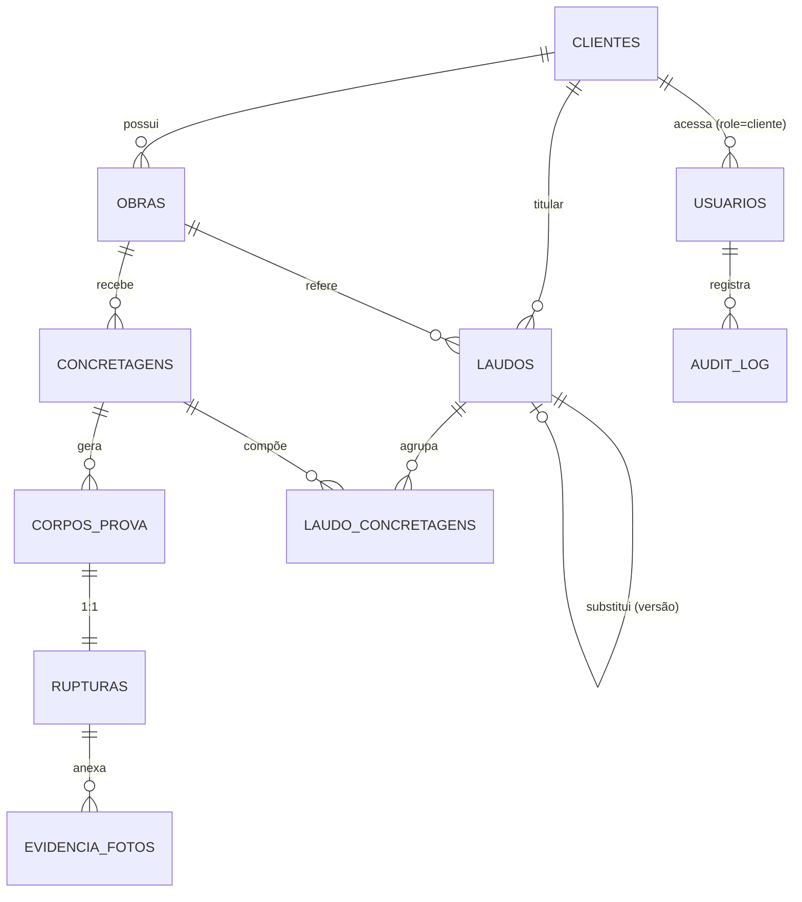

# Especificação Técnica (SPEC) — MVP Laboratório de Controle Tecnológico de Concreto

> **Versão:** 1.0
> **Data:** 03/07/2026
> **Base:** `PRD_MVP.md` (v2.0), `implementation_plan.md`, `MEMORIA_PROJETO.md`, `revisao_critica_prd.md`, e o layout do laudo de referência (`c36756fc-001_ENSAIO_7_DIAS_REBRASCOM_assinado.pdf`, descrito na Seção 11 do PRD).
> **Público-alvo:** Agentes Codificadores autônomos. Este documento é **literal e determinístico**: implemente exatamente o que está escrito. Onde o PRD era omisso, as premissas assumidas estão marcadas com **`[PREMISSA]`**.

---

## Convenção de leitura deste documento

* **`[PREMISSA]`** — decisão de mercado adotada por omissão do PRD (Regra de Ouro). Documentada explicitamente.
* **`[FIXO]`** — decisão de domínio já validada com a engenheira. Não re-decidir.
* Todos os **identificadores de banco, tabelas, colunas, enums, funções e variáveis** estão em **inglês/snake_case (DB)** ou **camelCase (TS)**.
* Todo **texto de UI e mensagens** está em **português**.
* Mensagens de erro entre aspas (`"..."`) são o **texto exato** que deve aparecer na interface.

---

## 1. Visão Geral e Arquitetura Base

### 1.1. Resumo Técnico

Sistema de controle tecnológico de concreto composto por **um app mobile** (React Native + Expo, para campo e prensa), **um app web** (React + Vite, para escritório, portal do cliente e página pública de validação) e um **backend Supabase** (Postgres + Auth + Storage + Edge Functions). O sistema rastreia corpos de prova (CPs) do campo à prensa via QR Code, calcula resistência (MPa), gera laudos PDF juridicamente válidos com QR anti-fraude, e expõe validação pública sem login.

### 1.2. Padrões de Projeto

**Arquitetura escolhida:** **Monorepo modular com núcleo de domínio agnóstico de framework** (variação pragmática de Clean Architecture).

| Camada | Onde vive | Responsabilidade |
|---|---|---|
| **Domain Core** (puro, sem dependências de UI/rede) | `packages/shared` | Cálculo de MPa, projeção 7/14→28d, máquinas de estado (enums + guardas), schemas Zod, tipos, constantes, catálogo de mensagens. **Testado uma única vez, reutilizado por mobile, web e Edge Functions.** |
| **Data/Infra** | `packages/supabase` + `supabase/` | Cliente Supabase tipado, tipos gerados do banco, migrations, RLS, RPCs, Edge Functions. |
| **Application/Feature** | `apps/mobile/src/features/*`, `apps/web/src/features/*` | Telas, hooks, orquestração de casos de uso, chamadas ao backend. |
| **Presentation/UI kit** | `apps/*/src/components/ui` | Componentes reutilizáveis (botões grandes de alto contraste no mobile). |

**Motivo:** o domínio contém regras jurídicas/normativas (cálculo de MPa, guardas de estado, projeção). Centralizá-las num pacote puro e testável (princípios **DRY** e **Dependency Inversion / SOLID**) garante que o mesmo cálculo rode idêntico no app da prensa, no painel web e na Edge Function que gera o PDF — eliminando divergência de resultado, que num laudo jurídico é inaceitável.

**`[PREMISSA]` Gerenciador de monorepo:** **pnpm workspaces + Turborepo**. Justificativa: build incremental, cache de tarefas, compartilhamento de tipos sem publicar pacotes.

### 1.3. Convenções de Código `[FIXO + PREMISSA]`

| Item | Regra |
|---|---|
| Idioma do código | Nomes de variáveis/funções/tipos e **comentários** em **inglês**. `[FIXO]` |
| Idioma da UI | Todos os textos visíveis ao usuário e mensagens (inclusive respostas da IA) em **português**. `[FIXO]` |
| Nomenclatura DB | `snake_case` para tabelas/colunas/enums/funções Postgres. |
| Nomenclatura TS | `camelCase` para variáveis/funções; `PascalCase` para tipos/componentes; `SCREAMING_SNAKE_CASE` para constantes. |
| Arquivos | `kebab-case.ts` para módulos utilitários; `PascalCase.tsx` para componentes React. |
| Tipagem | TypeScript em modo **strict** (`"strict": true`, `noUncheckedIndexedAccess: true`). Proibido `any` implícito. |
| Linting | **ESLint** (`@typescript-eslint`, `eslint-plugin-react`, `eslint-plugin-react-hooks`, `eslint-plugin-import`) + **Prettier**. `[PREMISSA]` |
| Pre-commit | **Husky + lint-staged**: roda `eslint --fix`, `prettier` e `tsc --noEmit` nos arquivos alterados. `[PREMISSA]` |
| Formatação | Prettier: `printWidth: 100`, `singleQuote: true`, `semi: true`, `trailingComma: "all"`. `[PREMISSA]` |
| Validação de dados | **Zod** em toda fronteira (formulários, payloads de Edge Function, respostas de API). Schemas vivem em `packages/shared`. |
| Tratamento global de erros | Ver §1.4. |
| Clean code | DRY e SOLID obrigatórios. Funções puras no domínio; efeitos colaterais isolados na camada de infra. `[FIXO]` |
| Ergonomia mobile | Telas de prensa/campo: botões ≥ **56dp** de altura, contraste **AA+** (razão ≥ 4.5:1), tipografia ≥ 18sp. `[FIXO]` |
| Offline | **Fora de escopo.** O app exige internet; sem conexão, exibir banner "Sem conexão com a internet." e desabilitar ações de escrita. `[FIXO]` |

### 1.4. Tratamento Global de Erros `[PREMISSA]`

**Frontend (mobile e web):**
1. Todas as chamadas de rede passam por um **cliente HTTP central** (`packages/shared/src/http` ou wrapper do `supabase-js`) que normaliza erros para o tipo `AppError { code, message, httpStatus, details? }`.
2. **React Query** (`@tanstack/react-query`) gerencia estados `isLoading/isError/data` e retries. Mutations não fazem retry automático em 4xx; fazem até 2 retries em erros de rede/5xx com backoff.
3. Um **ErrorBoundary** global captura exceções de render e exibe tela de fallback: "Ocorreu um erro inesperado. Tente novamente." + botão "Recarregar".
4. Erros HTTP são mapeados para mensagens PT padronizadas (catálogo em §3.0). Nenhuma mensagem crua da API/Postgres/OpenAI é exibida ao usuário.
5. Toasts para erros recuperáveis; telas de estado para erros de carregamento.

**Backend (Edge Functions):** toda função retorna o envelope de erro padrão `{ "error": "<code>", "message": "<pt-BR>" }` (§5) com o HTTP status adequado, e loga o erro técnico (stack, request id) via `console.error` estruturado (nunca vaza detalhe interno ao cliente).

---

## 2. Divisão de Sprints e Alocação de Agentes

Sprints incrementais. Cada uma entrega software executável e testável. Dependências são estritamente sequenciais salvo indicação.

| Sprint | Objetivo | Depende de |
|---|---|---|
| **S001** | Fundação do monorepo + Supabase (schema, enums, RLS, audit, Auth/RBAC) | — |
| **S002** | Núcleo de domínio (`packages/shared`): cálculo MPa, projeção, máquinas de estado, Zod, constantes | S001 |
| **S003** | Auth & shells de navegação (mobile + web), UI kit, roteamento por papel | S001, S002 |
| **S004** | Clientes/Usuários + Obras (CRUD) + Concretagem + OCR da NF (Edge Function) | S003 |
| **S005** | Corpos de prova, etiquetas Bluetooth, agenda de coleta, bipagem QR | S004 |
| **S006** | Prensa: ruptura + cálculo MPa + fratura + descarte/expurgo + fotos de evidência | S005 |
| **S007** | Painel web escritório: realtime, edição de concretagem, laudos pré-prontos | S006 |
| **S008** | Geração de PDF travado + download/upload assinado + versionamento de laudo | S007 |
| **S009** | Portal do cliente + validação pública (QR) + exportação Excel + e-mails | S008 |
| **S010** | Hardening: dashboard operacional, testes E2E, rate limiting, revisão de segurança | S001–S009 |

### 2.1. Stack específica e Coder Agent por Sprint

| Sprint | Tech stack específica (bibliotecas exatas) | Coder Agent ID |
|---|---|---|
| **S001** | pnpm, Turborepo, TypeScript 5.x, Supabase CLI, Postgres 15, `supabase/migrations`, pgTAP (testes RLS) | `Agent-DevOps`, `Agent-DB-Postgres` |
| **S002** | TypeScript, Zod, Vitest (testes unitários do domínio) | `Agent-Backend-TS` |
| **S003** | Expo SDK 51+, React Native, `expo-router`, `nativewind`; React 18, Vite 5, Tailwind 3, `react-router-dom` 6; `@supabase/supabase-js` 2, `@tanstack/react-query` 5, `zustand`, `react-hook-form`, `zod` | `Agent-Fullstack-RN-React` |
| **S004** | `expo-camera`, `expo-image-picker`, `expo-location`; Edge Function (Deno) + OpenAI `gpt-4o-mini` Vision; `exceljs` (não aqui); `react-hook-form`+`zod` | `Agent-Mobile-RN`, `Agent-Backend-Edge` |
| **S005** | `react-native-ble-plx` (BLE, via Expo config plugin / dev client), gerador ESC/POS próprio, `qrcode` (geração), `expo-camera` (leitura de QR) | `Agent-Mobile-RN` |
| **S006** | `packages/shared` (MPa), `react-native-view-shot` (marca d'água), `expo-location`, Supabase Storage | `Agent-Mobile-RN`, `Agent-Backend-Edge` |
| **S007** | React + Vite, `@tanstack/react-query`, Supabase Realtime (`postgres_changes`), `recharts` | `Agent-Frontend-React` |
| **S008** | Edge Function (Deno): `@cantoo/pdf-lib` (composição + criptografia/permissões), `qrcode`, `@resvg/resvg-wasm` (SVG→PNG do gráfico) | `Agent-Backend-Edge`, `Agent-Frontend-React` |
| **S009** | React web (portal + página pública), Edge Function `exportar-excel` (`exceljs`), **Resend** (e-mail transacional via Edge Function) + Supabase Auth invites | `Agent-Frontend-React`, `Agent-Backend-Edge` |
| **S010** | Vitest, React Native Testing Library, Playwright (E2E web), pgTAP; ESLint/Prettier; revisão de segurança | `Agent-QA`, `Agent-DevOps` |

### 2.2. Registro de escolhas de biblioteca `[PREMISSA]` (dentro da stack travada)

| Necessidade | Escolha | Justificativa |
|---|---|---|
| Navegação mobile | **expo-router** | Roteamento por arquivos, deep links, moderno. |
| Navegação web | **react-router-dom v6** | Padrão de mercado para Vite/React SPA. |
| Estado servidor / cache | **@tanstack/react-query v5** | Cache, revalidação, estados de loading/erro padronizados. |
| Estado local de UI | **zustand** | Leve, sem boilerplate; sessão/UI transitória. |
| Formulários + validação | **react-hook-form + zod** | Validação declarativa reutilizável cliente/servidor. |
| Estilo mobile | **nativewind** (Tailwind p/ RN) | Tokens de design consistentes com o web. |
| Gráficos (web/laudo interativo) | **recharts** | Curva de resistência + linha de fck. |
| Gráfico no PDF | SVG gerado + **@resvg/resvg-wasm** → PNG | Rasteriza no Deno sem headless browser. |
| Geração de PDF + permissões | **@cantoo/pdf-lib** (fork do `pdf-lib` com `encrypt()`) | Compõe o layout e aplica `ReadOnly/AllowPrinting/AllowCopy=false`. |
| QR Code (geração) | **qrcode** (npm, roda em Deno e RN) | Etiquetas e rodapé do laudo. |
| Leitura de QR (mobile) | **expo-camera** (barcode scanning nativo) | `expo-barcode-scanner` foi descontinuado; expo-camera é o caminho atual. |
| Impressão térmica BLE | **react-native-ble-plx** + comandos **ESC/POS** próprios | Impressora térmica portátil; QR enviado como raster (`GS v 0`). Requer **dev client (EAS Build)** — não funciona no Expo Go. |
| Marca d'água em foto | **react-native-view-shot** sobre View com overlay | Captura foto + texto (data/hora/cidade/GPS) antes do upload. |
| Exportação Excel | **exceljs** (Edge Function) | Estilização de células, MIT, roda em Deno via esm.sh. |
| E-mail transacional | **Resend** (Edge Function) + `inviteUserByEmail` (Auth) | Supabase não envia e-mail transacional arbitrário; Resend tem suporte Deno. |
| Testes unitários domínio/web | **Vitest** | Nativo Vite; roda o `packages/shared`. |
| Testes unitários mobile | **Jest + React Native Testing Library** | Padrão Expo/RN. |
| Testes de RLS | **pgTAP** | Testa políticas RLS no próprio Postgres. |
| Testes E2E web | **Playwright** | Fluxos críticos (login, validação pública). |

---

## 3. Features e Definition of Done (DoD) Absoluto  `[CRÍTICO]`

### 3.0. Catálogo Global de Mensagens e Tratamento HTTP `[PREMISSA + FIXO]`

**Mensagens de erro HTTP genéricas (usadas em qualquer tela quando não houver mensagem específica):**

| Situação | HTTP | Mensagem exata na UI | Ação da UI |
|---|---|---|---|
| Sessão expirada / não autenticado | 401 | "Sua sessão expirou. Faça login novamente." | Redireciona para tela de login; limpa sessão. |
| Sem permissão | 403 | "Você não tem permissão para executar esta ação." | Toast; mantém tela; não altera dados. |
| Recurso não encontrado | 404 | "Registro não encontrado." | Toast; volta à listagem. |
| Conflito de concorrência | 409 | "Dados foram alterados por outro usuário. Recarregue a página." | Bloqueia o save; oferece "Recarregar". |
| Validação de payload | 400 | "Verifique os campos destacados." (+ erros por campo) | Destaca campos inválidos (borda vermelha + texto). |
| Rate limit | 429 | "Limite de tentativas atingido. Tente novamente mais tarde." | Desabilita ação temporariamente. |
| Erro do servidor | 500 | "Erro inesperado. Tente novamente em instantes." | Toast + botão "Tentar novamente". |
| Sem internet | — | "Sem conexão com a internet." | Banner persistente; desabilita escrita. |

**Estados de UI padrão (aplicáveis a toda tela com dados):**

| Estado | Comportamento visual obrigatório |
|---|---|
| **Loading** | Botão de submit recebe `disabled=true` + spinner interno; listas exibem skeleton; nenhuma dupla submissão possível. |
| **Success** | Toast verde de confirmação (texto específico por feature); navega/atualiza a lista. |
| **Error** | Ver catálogo acima; mantém dados digitados; nunca perde input do usuário. |
| **Empty** | Ilustração/ícone + texto + CTA (ex.: "Nenhuma concretagem cadastrada. Toque em + para começar."). |

---

### Sprint S001 — Fundação Supabase, RBAC e Auditoria

**F-S001-1 — Schema, enums e migrations** (detalhes completos em §4)
* **Regras de negócio:** todas as tabelas, enums e relacionamentos da §4; retenção vitalícia (sem `DELETE` físico em tabelas críticas); `updated_at` em `concretagens` e `laudos` (optimistic locking).
* **DoD (Happy):** `supabase db reset` aplica todas as migrations sem erro; `supabase gen types typescript` produz os tipos consumidos por `packages/supabase`.
* **Sad path:** migration idempotente; falha de migration aborta o deploy (CI vermelho).

**F-S001-2 — RLS traduzindo a Matriz RBAC**
* **Regras:** implementar exatamente a matriz da §4.3. Página pública é o único acesso anônimo (somente leitura por `codigo_verificacao`).
* **DoD:** testes pgTAP cobrindo, por tabela, um caso permitido e um negado por papel (ver §7.2).
* **Sad path:** qualquer query sem policy correspondente é **negada por padrão** (RLS `ENABLE` + sem policy permissiva = negado).

**F-S001-3 — Auditoria automática**
* **Regras:** trigger `audit_trigger` em `INSERT/UPDATE/DELETE` das tabelas críticas (`concretagens, corpos_prova, rupturas, laudos, obras, clientes, usuarios`), gravando `old_value/new_value/user_id/action/motivo`.
* **DoD:** um `UPDATE` em `concretagens.fck_projeto` gera 1 linha em `audit_log` com `old_value.fck_projeto ≠ new_value.fck_projeto`.

**F-S001-4 — Auth e provisionamento de papéis**
* **Regras:** `usuarios` 1:1 com `auth.users`; `role` e `is_admin` definidos no cadastro (S004). Trigger `on_auth_user_created` cria o perfil.
* **DoD:** criar um usuário via Auth resulta em uma linha em `usuarios` com `role` default `cliente` (ajustável pelo admin).

---

### Sprint S002 — Núcleo de Domínio (`packages/shared`)

**F-S002-1 — Cálculo de resistência (MPa)** `[FIXO]`
* **Função:** `calcMpa({ cargaKgf, dNominalMm })` em `packages/shared/src/engineering/mpa.ts`.
* **Fórmula:** `MPa = (cargaKgf × 9.80665) / (π × dNominalMm² / 4)`. Usa **diâmetro nominal**.
* **Arredondamento:** MPa **2 casas decimais**; KGF **inteiro** (`Math.round`).
* **DoD (vetores de teste obrigatórios, molde 100×200, área 7853.98 mm²):**
  * 21977 kgf → **27.44 MPa**
  * 24194 kgf → **30.21 MPa**
  * 20045 kgf → **25.03 MPa**
  * 23562 kgf → **29.42 MPa**
* **Sad path:** `cargaKgf ≤ 0` ou `dNominalMm ≤ 0` ⇒ lança `DomainError('CARGA_INVALIDA' | 'DIAMETRO_INVALIDO')`.

**F-S002-2 — Projeção 7/14 → 28 dias** `[FIXO]`
* **Função:** `estimateF28({ fIdade, idadeDias, fatores })`. `f28 = fIdade / fator(idade)`. Defaults **configuráveis**: `7d = 0.70`, `14d = 0.90` (lidos de `app_settings`, ver §4). Opcional: faixa com `0.65`/`0.85`.
* **DoD:** `estimateF28({ fIdade: 21, idadeDias: 7 })` → `30.00`; idade sem fator configurado ⇒ retorna `null` (não projeta).

**F-S002-3 — Máquinas de estado (enums + guardas)** `[FIXO]`
* **CP:** `moldado | coletado | rompido | descartado | expurgado`. Guardas conforme PRD §5.1 (ex.: `canRomper(cp)` bloqueia ruptura antecipada de CP `mandatorio_28d`; `descartar/expurgar` exigem `motivo`).
* **Laudo:** `rascunho | pronto_assinatura | assinado | substituido`. Guardas §5.2 (ex.: `canMarcarAssinado(laudo)` exige `pdfAssinadoUrl`).
* **Funções:** `canTransition(entity, from, to, context): { ok: boolean; reason?: string }`.
* **DoD:** cobertura de teste de cada transição válida e de cada transição inválida com a razão correta.

**F-S002-4 — Schemas Zod, constantes e catálogo de mensagens**
* Schemas de `Concretagem`, `Obra`, `Cliente`, `Ruptura`, `Laudo`, payloads de Edge Functions.
* Constantes: `FRATURA_TIPOS` (6 rótulos), `ENGINEERING_RANGES` (§7.4), `DEFAULT_PROJECTION_FACTORS`.
* Catálogo PT das mensagens (§3.0) exportado como `MESSAGES`.

---

### Sprint S003 — Auth & Navegação

**F-S003-1 — Login (mobile e web)** (US17 para cliente; login interno para os 3 papéis internos)
* **Regras de negócio:** Supabase Auth (e-mail+senha). Todos os papéis internos logam em **ambas** as plataformas. Cliente loga apenas no web (mas a autenticação não bloqueia por plataforma; o roteamento é que direciona).
* **Critérios de aceite (Happy):**
  1. Dado credenciais válidas, ao submeter, então cria sessão e redireciona para a home do papel (`socio_campo`→mobile campo; `eng_lab`→prensa/painel; `eng_escritorio`→painel web; `cliente`→portal).
* **Sad path (US17-CA2):**
  * Credenciais inválidas ⇒ **mensagem genérica** "E-mail ou senha inválidos." (nunca revelar se o e-mail existe).
  * 401/expiração ⇒ catálogo §3.0.
  * 3+ tentativas erradas em 5 min ⇒ "Muitas tentativas. Aguarde 1 minuto e tente novamente." (`[PREMISSA]` rate limit client-side + Supabase Auth já limita).
* **Estados de UI:** botão "Entrar" `disabled` + spinner durante o request; campos travados durante loading.

**F-S003-2 — Roteamento por papel e proteção de rotas**
* **Regras:** `role` lida do JWT/`usuarios`. Rotas protegidas por papel; acesso indevido ⇒ redireciona à home do papel + toast "Você não tem permissão para acessar esta página."
* **DoD:** `socio_campo` não acessa telas de gestão de usuários (web) nem prensa; tentativa redireciona.

**F-S003-3 — UI kit ergonômico**
* Componentes: `BigButton` (≥56dp, alto contraste), `NumericInput` (teclado numérico grande), `StatusPill`, `Toast`, `EmptyState`, `LoadingButton`. Usados por todo o app.

---

### Sprint S004 — Clientes, Usuários, Obras, Concretagem e OCR

**F-S004-1 — CRUD de Clientes e Usuários (US16)** — Web, admins apenas
* **Regras (RBAC):** só `eng_lab`/`eng_escritorio` (admins). `socio_campo`/`cliente` ⇒ negado.
* **Happy (US16-CA1):** admin cadastra cliente (nome, CNPJ, e-mail); sistema cria a credencial via `inviteUserByEmail` e envia e-mail de boas-vindas com link do portal e definição de senha (US24-CA4).
* **Sad path:**
  * Não-admin tenta acessar ⇒ 403 "Você não tem permissão para executar esta ação." (US16-CA2).
  * CNPJ inválido (falha na validação de dígitos) ⇒ "CNPJ inválido." (`[PREMISSA]` validação de CNPJ).
  * E-mail já cadastrado ⇒ "Já existe um usuário com este e-mail."
* **Auditoria:** criação gera `audit_log` (US16-CA3).
* **Estados:** formulário com submit `disabled`+spinner; sucesso ⇒ "Cliente cadastrado e convite enviado."; empty ⇒ "Nenhum cliente cadastrado."

**F-S004-2 — Cadastro de Obra (US20)** — Mobile (e web)
* **Regras:** `sigla` **única por cliente**; GPS automático se autorizado.
* **Happy (US20-CA1/CA2):** informa nome, sigla, cliente e salva ⇒ obra disponível na tela de concretagem; se GPS autorizado, preenche `gps_latitude/longitude`; se negado, cria **sem** GPS (não bloqueia).
* **Sad path (US20-CA3):** sigla duplicada para o mesmo cliente ⇒ "Já existe uma obra com esta sigla para este cliente." e impede salvar (constraint `UNIQUE(cliente_id, sigla)` + tratamento 409/23505).
* **Estados:** loading no submit; empty na lista ⇒ "Nenhuma obra cadastrada. Toque em + para criar."

**F-S004-3 — Edição/Inativação de Obra (US21)**
* **Happy:** editar campos; inativar (soft-delete `ativo=false`).
* **Sad path (US21-CA1):** tentar **excluir** obra com concretagens ⇒ impede e oferece "Inativar"; mensagem "Esta obra possui concretagens e não pode ser excluída. Você pode inativá-la."
* **RBAC (US21-CA2):** `socio_campo` editando obra que **não** criou ⇒ 403.

**F-S004-4 — OCR da Nota Fiscal (US01)** — Mobile + Edge Function
* **Regras de negócio:**
  * Fluxo: `Foto → Edge Function (GPT-4o-mini Vision) → formulário preenchido → revisão manual → Salvar`.
  * Campos extraídos: `nf_numero`, `fck_projeto`, `volume_m3`, `concreteira`, `data_concretagem`.
  * **Obrigatórios:** `nf_numero`, `fck_projeto`, `volume_m3`.
  * **Rate limit: máx. 3 tentativas de OCR por concretagem** (tabela `ocr_attempts`, §4).
  * Timeout de OCR: **10s**.
* **Happy (US01-CA1):** foto processada ⇒ campos preenchidos automaticamente.
* **Sad path:**
  * Campo vazio ou confiança < limiar (`[PREMISSA]` limiar = **0.75**) ⇒ campo destacado em **amarelo** para revisão (US01-CA2).
  * Obrigatório vazio ao salvar ⇒ bloqueia: "Preencha os campos obrigatórios destacados." (US01-CA3).
  * Timeout (>10s) ou erro da API ⇒ "Não foi possível processar. Preencha manualmente.", loga o erro, habilita "Preenchimento Manual" (US01-CA4).
  * 4ª tentativa de OCR ⇒ 429 "Limite de 3 tentativas de leitura atingido. Preencha manualmente." (US01-CA5).
  * Foto ruim ⇒ botão "Refazer" antes de enviar (US01-CA6).
* **Estados:** durante OCR, overlay "Lendo nota fiscal…" + spinner; botões desabilitados; "Preenchimento Manual" sempre visível como fallback.

**F-S004-5 — Edição manual e configuração de moldagem (US02)**
* **Happy (US02-CA1):** editar qualquer campo do OCR ⇒ valor manual prevalece; campo perde o destaque amarelo.
* **Configuração de CPs (US02-CA2)** `[FIXO]`: sócio define **quantidade de CPs e idade-alvo de cada um** (totalmente configurável, sem número fixo). Atalhos rápidos opcionais ("2×7d + 2×14d + 2×28d", "2×7d + 2×28d") — nenhum obrigatório.
  * Ao salvar (via RPC `criar_concretagem_com_cps`), gera exatamente **N** registros de CP com suas `idade_alvo_dias` e `data_ruptura_planejada = data_moldagem + idade_alvo_dias`.
  * Os **2 CPs de maior idade-alvo** recebem `mandatorio_28d = true`.
* **Slump `[FIXO]`:** armazenar `slump_projeto`, `slump_tolerancia`, `slump_medido` **em mm**. UI mostra a unidade e **converte cm→mm (×10)**; label explícito: "Slump (mm)". Fora de `slump_projeto ± tolerância` ⇒ **aviso não bloqueante** + marca para ressalva no laudo.
* **Sad path:** valores fora das faixas de engenharia (§7.4) ⇒ aviso/confirmação conforme a tabela; erro de save ⇒ mantém formulário.

---

### Sprint S005 — Corpos de Prova, Etiquetas, Coleta

**F-S005-1 — Impressão de etiquetas Bluetooth (US03)** — Mobile
* **Regras:** N etiquetas (derivadas da config), cada uma com **QR Code (`codigo_rastreio`), Sigla da Obra, Data de Moldagem, Idade-Alvo, ID legível**. Etiqueta impermeável (resistir à cura por 28 dias — requisito físico do papel; o app envia raster nítido).
* **Happy (US03-CA1):** "Gerar Etiquetas" ⇒ envia N etiquetas em sequência via ESC/POS (QR como raster `GS v 0`).
* **Sad path:**
  * Impressora desconectada/sem papel ⇒ status de conexão; após **timeout 5s**, marca etiqueta "❌ falhou" (US03-CA2).
  * Checklist visual por etiqueta: ✅ impressa / ❌ falhou / 🔄 pendente (US03-CA3).
  * Mais de um dispositivo BT pareado ⇒ tela de seleção/confirmação antes de imprimir (US03-CA4).
  * BLE indisponível/permissão negada ⇒ "Ative o Bluetooth e conceda as permissões para imprimir."
* **Estados:** durante impressão, botão "Gerar Etiquetas" `disabled`; checklist atualiza item a item; permite "Reimprimir" itens que falharam.

**F-S005-2 — Reimpressão (US04)**
* **Happy:** selecionar CP no histórico + "Reimprimir" ⇒ reenvia só aquela etiqueta, **sem** duplicar `codigo_rastreio`.

**F-S005-3 — Agenda de Coletas (US05)**
* **Happy (US05-CA1):** CP `moldado` há ≥ 24h aparece; < 24h ou já `coletado` não aparece.
* **Regra (US05-CA2):** coleta > 24h ⇒ marca CP para **ressalva textual automática** no laudo (não bloqueia); campo derivado `coleta_atrasada`.
* **Empty:** "Nenhuma coleta pendente para hoje."

**F-S005-4 — Coleta / bipar QR (US06)**
* **Happy (US06-CA1):** bipar QR válido de CP `moldado` ⇒ status `coletado`, grava `coletado_por` e `coletado_em` (via RPC `coletar_cp` que aplica guarda de estado).
* **Sad path (US06-CA2):**
  * QR sem CP correspondente ⇒ "CP não encontrado."
  * CP já `coletado` ⇒ "CP já coletado." (não altera nada).
  * CP em estado terminal (`descartado`/`rompido`/`expurgado`) ⇒ "Este CP não pode ser coletado (status atual: {status})."
* **Estados:** câmera com moldura de leitura; feedback sonoro/visual ao bipar; loading curto durante a transição.

---

### Sprint S006 — Prensa (Ruptura)

**F-S006-1 — Lista de CPs a romper (US07)** — Mobile
* **Happy (US07-CA1):** CPs `coletado` com `data_ruptura_planejada ≤ hoje`, de **todos** os clientes, aparecem na lista do dia.
* **Busca (US07-CA2):** busca por QR localiza o CP imediatamente.
* **Empty:** "Nenhum CP para romper hoje."

**F-S006-2 — Registro de ruptura + cálculo MPa (US08)**
* **Regras:** inputs Peso (g), Diâmetro medido (mm), Altura medida (mm), Carga (kgf). Cálculo usa **`diametro_nominal_mm`** (herdado da concretagem/molde), não o medido. Chama `calcMpa` (S002).
* **Happy (US08-CA1):** Carga=23562, molde nominal 100 ⇒ Área **7853.98 mm²**, **MPa 29.42** (2 casas; KGF inteiro).
* **Sad path (US08-CA2):** valores fora das faixas (§7.4) ⇒ aviso/confirmação (não corrompe o cálculo). Carga muito baixa ⇒ "Valor muito baixo. Você digitou em kN em vez de kgf?".
* **Transição (US08-CA3):** ao salvar (RPC `registrar_ruptura`), CP→`rompido`, grava `executado_por`, e **gera/atualiza o rascunho de laudo** da concretagem.
* **Guarda (US08-CA4):** romper CP `mandatorio_28d` **antes** da idade ⇒ **impedido**: "Este CP de {idade}d é obrigatório e não pode ser rompido antes da idade prevista ({data})."
* **Estados:** botão "Salvar Ruptura" `disabled` até campos válidos; exibe MPa calculado em tempo real (grande, alto contraste); confirmação antes de gravar.

**F-S006-3 — Tipo de fratura (US09)**
* **Happy:** opções **exatas** com ícone: **Ruptura de Cabeça, Ruptura de Face, Ruptura Parcial, Ruptura Total, Ruptura de Cisalhamento, Ruptura de Trinca**. Salvo em `rupturas.tipo_fratura`.
* **Sad path:** salvar ruptura sem escolher fratura ⇒ "Selecione o tipo de fratura."

**F-S006-4 — Descartar CP / Expurgar resultado (US10)**
* **Regras (RBAC):** apenas `eng_lab`. `motivo` **obrigatório** em ambos.
* **Happy:**
  * `rompido` + "Descartar Resultado" + motivo ⇒ `expurgado` (sai da média) (US10-CA1).
  * CP danificado antes do ensaio + "Descartar CP" + motivo ⇒ `descartado` (US10-CA2).
* **Regra (US10-CA3):** se **todos** os CPs de uma idade ficam `descartado`/`expurgado` ⇒ idade sinalizada **expurgada**; laudo daquela idade não é emitido.
* **Sad path:** motivo vazio ⇒ "Informe o motivo do descarte/expurgo." (bloqueia).
* **Auditoria (US10-CA4):** ação gera `audit_log` com `motivo`.

**F-S006-5 — Fotos de evidência Antes/Depois (US11)**
* **Regras:** enviadas **direto do app ao Storage** (bucket privado `evidencias`), com **marca d'água** (data, hora, cidade, GPS) aplicada no cliente via `react-native-view-shot`. **Nunca** aparecem no laudo do cliente nem são acessíveis por ele (US11-CA2).
* **Sad path (US11-CA3):** GPS negado ⇒ marca d'água sem coordenadas (não bloqueia).
* **RBAC:** visíveis só a `eng_lab`/`eng_escritorio`.
* **Estados:** upload com barra de progresso; falha ⇒ "Falha ao enviar a foto. Tente novamente." (mantém a foto local para retry).

---

### Sprint S007 — Painel Web (Escritório)

**F-S007-1 — Visualização em tempo real (US12)**
* **Happy:** concretagem salva no mobile aparece no painel sem recarregar (Supabase Realtime `postgres_changes` na tabela `concretagens`), ou refresh ≤ poucos segundos.
* **Empty/Loading/Error:** skeleton na tabela; erro ⇒ "Não foi possível carregar as concretagens." + "Tentar novamente".

**F-S007-2 — Edição de concretagem (US12b)**
* **Regras (RBAC):** `eng_lab`/`eng_escritorio`. Optimistic locking via `updated_at`.
* **Happy (US12b-CA1):** editar/salvar ⇒ grava e gera `audit_log` (`old_value/new_value`).
* **Sad path (US12b-CA2):** `updated_at` mudou desde a leitura ⇒ 409 "Dados foram alterados por outro usuário. Recarregue a página." (não sobrescreve).

**F-S007-3 — Laudos pré-prontos (US13)**
* **Happy:**
  * ≥1 ruptura válida ⇒ existe **rascunho de laudo por NF** (padrão), pré-preenchido (US13-CA1).
  * Emitir **parcial** (7d/14d) sob solicitação; por padrão, **final (28d)** consolida 7/14/28 + gráfico (US13-CA2).
  * **Agrupamento opcional** de várias NFs da mesma obra ⇒ laudo consolidado (`laudo_concretagens`) (US13-CA3).
* **Sad path:** tentar marcar `pronto_assinatura` com CPs pendentes (não terminais) ⇒ "Existem CPs pendentes nesta(s) idade(s). Conclua os rompimentos antes de avançar."
* **Estados:** lista de rascunhos com filtro por obra/NF; empty ⇒ "Nenhum laudo pré-pronto. Eles aparecem após o primeiro rompimento válido."

---

### Sprint S008 — Geração de PDF, Assinatura, Versionamento

**F-S008-1 — Geração do PDF travado (US14)** — Edge Function `gerar-laudo-pdf`
* **Regras:** conteúdo exato do §11 do PRD (cabeçalho+logo, dados cliente/obra, tabela `DATA|QUADRA|LOTE|NF|LACRE|CP|KGF|MPa|FCM` por idade, **gráfico** de resistência com **linha do fck**, considerações finais + ressalvas automáticas, assinaturas RT/Laboratorista/Moldador, **QR Code no rodapé**). Permissões: `ReadOnly=true, AllowPrinting=true, AllowCopy=false`.
* **Happy (US14-CA1/CA2):** laudo `pronto_assinatura` + "Gerar PDF" ⇒ arquivo salvo em `laudos/<id>/original.pdf` (bucket privado), `pdf_original_url` preenchido; gráfico mostra curva entre idades + linha de fck de projeto.
* **Ressalvas (US14-CA3):** coleta > 24h ou slump fora da tolerância ⇒ ressalva textual nas considerações finais.
* **Sad path:** laudo não está `pronto_assinatura` ⇒ 409 "O laudo precisa estar pronto para assinatura antes de gerar o PDF."; falha na rasterização do gráfico ⇒ 500 + log; sem resultados válidos ⇒ "Não há resultados válidos para gerar o laudo."
* **Estados:** botão "Gerar PDF" `disabled`+spinner "Gerando laudo…"; sucesso ⇒ "PDF gerado com sucesso."

**F-S008-2 — Download / Upload assinado (US15)**
* **Happy (US15-CA1):** "Baixar Laudo (PDF)" baixa o não assinado.
* **Happy (US15-CA2):** upload do PDF assinado (gov.br) ⇒ `pdf_assinado_url` preenchido e laudo → `assinado` **somente se** o arquivo existir. Uma assinatura (RT) basta; campo separado para 2ª assinatura (elaborador) opcional.
* **Sad path (US15-CA3):** marcar `assinado` sem `pdf_assinado_url` ⇒ impedido "Faça o upload do PDF assinado antes de publicar o laudo."; arquivo não-PDF ⇒ "Envie um arquivo PDF válido."
* **Publicação:** ao assinar, dispara e-mail ao cliente (US24-CA1).

**F-S008-3 — Correção / Versionamento (US22)**
* **Happy (US22-CA1):** corrigir laudo `assinado` ⇒ versão anterior vira `substituido`; nova versão (`versao+1`) referencia a anterior (`substitui_laudo_id`) via RPC `corrigir_laudo`.
* **Regra (US22-CA2):** página pública sempre resolve a **versão vigente** (não substituída); histórico auditável e retido.
* **Sad path:** corrigir laudo não-`assinado` ⇒ "Só é possível corrigir laudos já assinados."

---

### Sprint S009 — Portal Cliente, Validação Pública, Excel, E-mails

**F-S009-1 — Portal do cliente (US18)**
* **Happy (US18-CA1):** cliente lista e baixa apenas laudos `assinado` das **suas** obras (RLS por `cliente_id`); `rascunho/pronto_assinatura/substituido` não aparecem.
* **Filtro (US18-CA2):** por obra.
* **Empty:** "Você ainda não possui laudos disponíveis."

**F-S009-2 — Validação pública via QR (US19)** — Edge Function pública `validar-laudo` (GET, sem JWT)
* **Happy (US19-CA1):** abrir a página com `codigo_verificacao` ⇒ exibe laudo completo (dados cliente/obra, MPa/FCM por idade, status de autenticidade). Sempre a **versão vigente** (US19-CA2).
* **Sad path (US19-CA3):** código inexistente ⇒ "Laudo não encontrado / não autêntico."
* **Segurança:** único endpoint anônimo; read-only; sem exposição de fotos de evidência; rate limit por IP (§7).

**F-S009-3 — Exportação Excel (US23)** — Edge Function `exportar-excel`
* **Happy:** filtros (período, concreteira, fck alvo, obra) ⇒ Excel comparando MPa/FCM por concreteira e fck no período.
* **RBAC:** apenas engenheiros.
* **Sad path:** sem dados no filtro ⇒ "Nenhum dado encontrado para os filtros selecionados."

**F-S009-4 — Notificações por e-mail (US24)** — Edge Function `enviar-email` + Resend
* **Gatilhos:** laudo `assinado`→cliente (CA1); laudo `pronto_assinatura`→RT (CA2); CPs `moldado` >24h sem coleta→sócio (CA3, via cron diário); novo cliente→boas-vindas (CA4).
* **Sad path (US24-CA5):** falha de envio ⇒ loga em `email_events` e **re-tenta**; falha **não** bloqueia o fluxo operacional (ex.: publicação do laudo prossegue).

---

### Sprint S010 — Hardening

* **F-S010-1 Dashboard operacional (web home):** contadores de CPs moldados/coletados/rompidos (hoje/semana), laudos pendentes de assinatura, concretagens sem coleta >24h, próximos rompimentos. `[PREMISSA — melhoria do revisao_critica]`.
* **F-S010-2 Testes:** cobertura mínima §7.2; E2E Playwright (login, validação pública, portal).
* **F-S010-3 Segurança:** rate limits, headers CSP, revisão RLS, sanitização (§7).

---

## 4. Modelagem de Dados

> Sintaxe: DDL Postgres (pronta para migration Supabase). Todas as PKs são `uuid default gen_random_uuid()`. Todas as tabelas críticas têm `created_at timestamptz default now()`.

### 4.1. Enums

```sql
create type user_role      as enum ('socio_campo', 'eng_lab', 'eng_escritorio', 'cliente');
create type cp_status      as enum ('moldado', 'coletado', 'rompido', 'descartado', 'expurgado');
create type laudo_status   as enum ('rascunho', 'pronto_assinatura', 'assinado', 'substituido');
create type laudo_tipo     as enum ('parcial_7d', 'parcial_14d', 'final_28d');
create type audit_action   as enum ('INSERT', 'UPDATE', 'DELETE');
create type tipo_fratura   as enum (
  'ruptura_cabeca', 'ruptura_face', 'ruptura_parcial',
  'ruptura_total', 'ruptura_cisalhamento', 'ruptura_trinca'
);
```

### 4.2. Tabelas

```sql
-- Perfis de usuário (1:1 com auth.users)
create table usuarios (
  id           uuid primary key references auth.users(id) on delete cascade,
  nome         text not null,
  email        text not null unique,
  role         user_role not null default 'cliente',
  is_admin     boolean not null default false,          -- true p/ os 2 sócios engenheiros
  cliente_id   uuid references clientes(id),            -- preenchido só p/ role='cliente'
  ativo        boolean not null default true,           -- soft-disable
  created_at   timestamptz not null default now(),
  updated_at   timestamptz not null default now()
);

create table clientes (
  id           uuid primary key default gen_random_uuid(),
  nome         text not null,
  cnpj         varchar(18) unique,                      -- formatado 00.000.000/0000-00
  email        text,
  ativo        boolean not null default true,
  created_at   timestamptz not null default now(),
  updated_at   timestamptz not null default now()
);

create table obras (
  id            uuid primary key default gen_random_uuid(),
  cliente_id    uuid not null references clientes(id),
  nome          text not null,
  sigla         text not null,
  endereco      text,
  contato       text,
  gps_latitude  numeric(10,7),
  gps_longitude numeric(10,7),
  criado_por    uuid not null references usuarios(id),
  ativo         boolean not null default true,          -- soft-delete (retenção vitalícia)
  created_at    timestamptz not null default now(),
  updated_at    timestamptz not null default now(),
  constraint uq_obra_sigla_por_cliente unique (cliente_id, sigla)
);

create table concretagens (
  id                uuid primary key default gen_random_uuid(),
  obra_id           uuid not null references obras(id),
  data_concretagem  date not null,
  nf_numero         text not null,
  nf_foto_url       text,
  fck_projeto       numeric(5,2) not null,              -- MPa, capturado da NF (NÃO calculado)
  volume_m3         numeric(6,2) not null,
  concreteira       text,
  -- Slump em MM (converter cm->mm ao entrar)
  slump_projeto     numeric(5,1),
  slump_tolerancia  numeric(5,1),
  slump_medido      numeric(5,1),
  -- Molde / base do cálculo de MPa
  diametro_nominal_mm numeric(5,1) not null default 100, -- 100 (100x200) | 150 (150x300)
  altura_nominal_mm   numeric(5,1) not null default 200,
  -- Campos do laudo / numeração (opcionais)
  quadra            text,
  lote              text,
  traco             text,
  placa_caminhao    text,
  lacre_caminhao    text,
  aditivo           text,
  cadastrado_por    uuid not null references usuarios(id),
  created_at        timestamptz not null default now(),
  updated_at        timestamptz not null default now() -- optimistic locking
);

create table corpos_prova (
  id                     uuid primary key default gen_random_uuid(),
  concretagem_id         uuid not null references concretagens(id),
  codigo_rastreio        text not null unique,          -- QR Code
  data_moldagem          date not null,
  idade_alvo_dias        int not null,                  -- livre: 3|7|14|28|63|91...
  data_ruptura_planejada date not null,
  status                 cp_status not null default 'moldado',
  mandatorio_28d         boolean not null default false, -- 2 CPs de maior idade
  coleta_atrasada        boolean not null default false, -- derivado: coleta > 24h
  motivo_descarte        text,                           -- obrigatório em descarte/expurgo
  coletado_por           uuid references usuarios(id),
  coletado_em            timestamptz,
  created_at             timestamptz not null default now(),
  updated_at             timestamptz not null default now()
);

create table rupturas (
  id                 uuid primary key default gen_random_uuid(),
  corpo_prova_id     uuid not null unique references corpos_prova(id), -- 1:1
  data_ruptura_real  date not null default current_date,
  peso_g             numeric(7,1),
  diametro_mm        numeric(5,1),                       -- medido (rastreabilidade)
  altura_mm          numeric(5,1),                       -- medido (rastreabilidade)
  diametro_nominal_mm numeric(5,1) not null,             -- base do cálculo
  fator_correcao_hd  numeric(4,2) not null default 1.00, -- retífica futura
  carga_ruptura_kgf  numeric(9,0) not null,              -- KGF inteiro
  mpa_calculado      numeric(6,2) not null,              -- 2 casas
  tipo_fratura       tipo_fratura not null,
  motivo_expurgo     text,
  executado_por      uuid not null references usuarios(id),
  created_at         timestamptz not null default now()
);

-- Fotos de evidência (internas; nunca no laudo do cliente)
create table evidencia_fotos (
  id             uuid primary key default gen_random_uuid(),
  ruptura_id     uuid not null references rupturas(id),
  tipo           text not null check (tipo in ('antes','depois')),
  storage_path   text not null,                          -- bucket privado 'evidencias'
  created_at     timestamptz not null default now()
);

create table laudos (
  id                        uuid primary key default gen_random_uuid(),
  cliente_id                uuid not null references clientes(id),
  obra_id                   uuid not null references obras(id),
  tipo_laudo                laudo_tipo not null,
  numero                    text not null,               -- ex.: N°003AGEHAB / CT001-T2-CP1
  versao                    int not null default 1,
  substitui_laudo_id        uuid references laudos(id),
  codigo_verificacao        text not null unique,        -- hash anti-fraude (QR público)
  status                    laudo_status not null default 'rascunho',
  data_emissao              date,
  pdf_original_url          text,
  pdf_assinado_url          text,                         -- obrigatório p/ 'assinado'
  assinatura_rt_url         text,                         -- RT (obrigatória p/ publicar)
  assinatura_elaborador_url text,                         -- 2ª assinatura (opcional)
  criado_por                uuid not null references usuarios(id),
  created_at                timestamptz not null default now(),
  updated_at                timestamptz not null default now() -- optimistic locking
);

-- Junção: 1 laudo por NF (padrão) OU agrupamento de várias NFs da mesma obra
create table laudo_concretagens (
  laudo_id       uuid not null references laudos(id),
  concretagem_id uuid not null references concretagens(id),
  primary key (laudo_id, concretagem_id)
);

create table audit_log (
  id          uuid primary key default gen_random_uuid(),
  user_id     uuid references usuarios(id),
  action      audit_action not null,
  table_name  text not null,
  record_id   uuid not null,
  old_value   jsonb,
  new_value   jsonb,
  motivo      text,
  created_at  timestamptz not null default now()
);

-- Controle de rate limit de OCR (máx 3 por concretagem/rascunho)
create table ocr_attempts (
  id             uuid primary key default gen_random_uuid(),
  concretagem_ref text not null,                         -- id da concretagem OU chave do rascunho
  user_id        uuid not null references usuarios(id),
  success        boolean not null default false,
  created_at     timestamptz not null default now()
);

-- Log de e-mails (retry, US24-CA5)
create table email_events (
  id           uuid primary key default gen_random_uuid(),
  evento       text not null,                            -- laudo_assinado | pronto_assinatura | ...
  destinatario text not null,
  payload      jsonb,
  status       text not null default 'pendente',         -- pendente | enviado | falhou
  tentativas   int not null default 0,
  last_error   text,
  created_at   timestamptz not null default now(),
  updated_at   timestamptz not null default now()
);

-- Configurações globais (fatores de projeção, limiares)
create table app_settings (
  key    text primary key,                               -- 'projection_factor_7d', 'ocr_confidence_min'...
  value  jsonb not null,
  updated_at timestamptz not null default now()
);
-- seeds:
-- ('projection_factor_7d','0.70'), ('projection_factor_14d','0.90'),
-- ('projection_factor_7d_low','0.65'), ('projection_factor_14d_low','0.85'),
-- ('ocr_confidence_min','0.75'), ('ocr_max_attempts','3')
```

### 4.3. Diagrama de Relacionamentos (Mermaid)



### 4.4. Funções auxiliares e triggers

```sql
-- Papel do usuário atual (a partir do JWT/usuarios)
create or replace function current_role_name() returns user_role
language sql stable security definer as $$
  select role from usuarios where id = auth.uid();
$$;

create or replace function is_admin() returns boolean
language sql stable security definer as $$
  select coalesce(is_admin, false) from usuarios where id = auth.uid();
$$;

create or replace function current_cliente_id() returns uuid
language sql stable security definer as $$
  select cliente_id from usuarios where id = auth.uid();
$$;

-- updated_at automático
create or replace function set_updated_at() returns trigger
language plpgsql as $$
begin new.updated_at := now(); return new; end; $$;

-- Auditoria genérica
create or replace function audit_trigger() returns trigger
language plpgsql security definer as $$
begin
  insert into audit_log(user_id, action, table_name, record_id, old_value, new_value, motivo)
  values (
    auth.uid(), tg_op::audit_action, tg_table_name,
    coalesce(new.id, old.id),
    case when tg_op in ('UPDATE','DELETE') then to_jsonb(old) end,
    case when tg_op in ('INSERT','UPDATE') then to_jsonb(new) end,
    coalesce(new.motivo_descarte, new.motivo_expurgo, null)
  );
  return coalesce(new, old);
end; $$;

-- Aplicar em tabelas críticas (exemplo):
-- create trigger audit_concretagens after insert or update or delete on concretagens
--   for each row execute function audit_trigger();
-- (repetir p/ corpos_prova, rupturas, laudos, obras, clientes, usuarios)
```

### 4.5. Políticas RLS (traduzindo a Matriz RBAC do PRD §3.2)

> Todas as tabelas: `alter table X enable row level security;`. Sem policy permissiva = negado. `service_role` (Edge Functions com service key) ignora RLS quando necessário (uso restrito e auditado).

```sql
-- ===== usuarios =====
create policy usuarios_self_select on usuarios for select using (id = auth.uid() or is_admin());
create policy usuarios_admin_write on usuarios for all
  using (is_admin()) with check (is_admin());

-- ===== clientes ===== (CRUD só admins; cliente vê o próprio)
create policy clientes_admin_all on clientes for all
  using (is_admin()) with check (is_admin());
create policy clientes_self_select on clientes for select
  using (id = current_cliente_id());

-- ===== obras ===== (criar: internos; editar: autor socio_campo OU engenheiros; cliente: negado)
create policy obras_internos_select on obras for select
  using (current_role_name() in ('socio_campo','eng_lab','eng_escritorio'));
create policy obras_criar on obras for insert
  with check (current_role_name() in ('socio_campo','eng_lab','eng_escritorio'));
create policy obras_editar on obras for update
  using (is_admin() or (current_role_name() = 'socio_campo' and criado_por = auth.uid()))
  with check (is_admin() or (current_role_name() = 'socio_campo' and criado_por = auth.uid()));

-- ===== concretagens ===== (criar: internos; editar: só engenheiros; socio vê as suas)
create policy conc_select on concretagens for select using (
  is_admin()
  or (current_role_name() = 'socio_campo' and cadastrado_por = auth.uid())
);
create policy conc_insert on concretagens for insert
  with check (current_role_name() in ('socio_campo','eng_lab','eng_escritorio'));
create policy conc_update on concretagens for update
  using (is_admin()) with check (is_admin()); -- socio NÃO edita após salvar

-- ===== corpos_prova ===== (gerar: internos; coletar: socio/eng_lab; descartar/expurgar após coleta: eng_lab)
create policy cp_select on corpos_prova for select using (
  current_role_name() in ('socio_campo','eng_lab','eng_escritorio')
);
create policy cp_insert on corpos_prova for insert
  with check (current_role_name() in ('socio_campo','eng_lab','eng_escritorio'));
-- Coleta e descarte são feitos via RPCs SECURITY DEFINER que aplicam a guarda de papel/estado.

-- ===== rupturas ===== (registrar/expurgar: só eng_lab)
create policy rupt_select on rupturas for select using (
  current_role_name() in ('eng_lab','eng_escritorio')
);
create policy rupt_write on rupturas for all
  using (current_role_name() = 'eng_lab')
  with check (current_role_name() = 'eng_lab');

-- ===== evidencia_fotos ===== (enviar/ver: eng_lab/eng_escritorio; cliente NUNCA)
create policy evid_rw on evidencia_fotos for all
  using (current_role_name() in ('eng_lab','eng_escritorio'))
  with check (current_role_name() in ('eng_lab','eng_escritorio'));

-- ===== laudos ===== (gerar/editar/corrigir: engenheiros; cliente: só 'assinado' das suas obras)
create policy laudos_eng_all on laudos for all
  using (current_role_name() in ('eng_lab','eng_escritorio'))
  with check (current_role_name() in ('eng_lab','eng_escritorio'));
create policy laudos_cliente_select on laudos for select using (
  current_role_name() = 'cliente'
  and status = 'assinado'
  and cliente_id = current_cliente_id()
);

-- ===== laudo_concretagens ===== (segue laudos; engenheiros)
create policy lc_eng on laudo_concretagens for all
  using (current_role_name() in ('eng_lab','eng_escritorio'))
  with check (current_role_name() in ('eng_lab','eng_escritorio'));

-- ===== audit_log ===== (leitura só admins; escrita só via trigger/service)
create policy audit_admin_select on audit_log for select using (is_admin());
```

> **Página pública (US19):** implementada em Edge Function com **anon key** consultando por `codigo_verificacao` — **não** passa por policy de `laudos` autenticada; a função usa `service_role` e retorna **apenas** os campos permitidos (sem fotos de evidência).

### 4.6. RPCs (Postgres, `SECURITY DEFINER`) que aplicam as máquinas de estado

| RPC | Assinatura | Guardas |
|---|---|---|
| `criar_concretagem_com_cps` | `(concretagem jsonb, cps jsonb[])` | Cria concretagem + N CPs numa transação; marca 2 maiores idades como `mandatorio_28d`. |
| `coletar_cp` | `(cp_id uuid)` | CP deve estar `moldado`; grava `coletado_por/em`; senão erro `CP_ESTADO_INVALIDO`. |
| `registrar_ruptura` | `(cp_id uuid, dados jsonb)` | CP `coletado`; bloqueia `mandatorio_28d` antes da idade; calcula MPa; CP→`rompido`; cria/atualiza rascunho de laudo. |
| `descartar_cp` | `(cp_id uuid, motivo text)` | Exige `motivo`; CP `moldado`/`coletado`→`descartado`. |
| `expurgar_resultado` | `(cp_id uuid, motivo text)` | Exige `motivo`; CP `rompido`→`expurgado`. |
| `marcar_pronto_assinatura` | `(laudo_id uuid)` | Todos os CPs das idades cobertas em estado terminal; senão `CPS_PENDENTES`. |
| `corrigir_laudo` | `(laudo_id uuid)` | Laudo `assinado`→`substituido`; cria nova versão `versao+1`. |

---

## 5. Contratos de API (Edge Functions + RPC)

> **Base:** `https://<project>.supabase.co`. CRUD simples usa **PostgREST** (`/rest/v1/<tabela>`) sob RLS. Abaixo os **endpoints customizados** (Edge Functions) e RPCs relevantes. Todos exigem `Authorization: Bearer <JWT>` e `apikey: <anon>`, **exceto** `validar-laudo` (público).

**Envelope de erro padrão (todas as funções):**
```json
{ "error": "CODIGO_MAQUINA", "message": "Mensagem em português para a UI" }
```

### 5.1. `POST /functions/v1/ocr-nota-fiscal`
* **Headers:** `Authorization: Bearer <JWT>`.
* **Request:**
```json
{ "imageBase64": "<base64>", "concretagemRef": "rascunho-abc123" }
```
* **200:**
```json
{
  "fields": {
    "nf_numero":       { "value": "123456", "confidence": 0.98 },
    "fck_projeto":     { "value": 30, "confidence": 0.91 },
    "volume_m3":       { "value": 8, "confidence": 0.88 },
    "concreteira":     { "value": "Tarcal", "confidence": 0.95 },
    "data_concretagem":{ "value": "2026-05-20", "confidence": 0.70 }
  },
  "lowConfidenceFields": ["data_concretagem"]
}
```
* **Erros:**
  * `429 { "error": "OCR_LIMITE", "message": "Limite de 3 tentativas de leitura atingido. Preencha manualmente." }`
  * `504 { "error": "OCR_TIMEOUT", "message": "Não foi possível processar. Preencha manualmente." }`
  * `502 { "error": "OCR_FALHA", "message": "Não foi possível processar. Preencha manualmente." }`
* **Regras:** timeout 10s; incrementa `ocr_attempts`; confiança `< ocr_confidence_min` ⇒ campo em `lowConfidenceFields`.

### 5.2. `POST /rpc/registrar_ruptura` (PostgREST RPC)
* **Request:**
```json
{
  "cp_id": "uuid",
  "dados": {
    "peso_g": 3820, "diametro_mm": 100.2, "altura_mm": 200.1,
    "carga_ruptura_kgf": 23562, "tipo_fratura": "ruptura_cisalhamento"
  }
}
```
* **200:**
```json
{ "ruptura_id": "uuid", "mpa_calculado": 29.42, "area_mm2": 7853.98, "cp_status": "rompido", "laudo_rascunho_id": "uuid" }
```
* **Erros:**
  * `409 { "error": "CP_MANDATORIO_28D", "message": "Este CP de 28d é obrigatório e não pode ser rompido antes da idade prevista (2026-06-17)." }`
  * `409 { "error": "CP_ESTADO_INVALIDO", "message": "Este CP não está disponível para ruptura." }`
  * `400 { "error": "CARGA_INVALIDA", "message": "Informe uma carga de ruptura válida." }`

### 5.3. `POST /functions/v1/gerar-laudo-pdf`
* **Request:** `{ "laudo_id": "uuid" }`
* **200:** `{ "pdf_original_url": "laudos/<id>/original.pdf", "codigo_verificacao": "a1b2c3..." }`
* **Erros:**
  * `409 { "error": "LAUDO_NAO_PRONTO", "message": "O laudo precisa estar pronto para assinatura antes de gerar o PDF." }`
  * `422 { "error": "SEM_RESULTADOS", "message": "Não há resultados válidos para gerar o laudo." }`
* **Efeitos:** compõe PDF (§11), aplica `ReadOnly=true, AllowPrinting=true, AllowCopy=false`, insere QR com URL pública `/validar/<codigo_verificacao>`, salva no Storage.

### 5.4. `POST /functions/v1/upload-laudo-assinado` (ou via Storage + `PATCH /rest/v1/laudos`)
* **Request:** multipart `pdf` + `laudo_id`.
* **200:** `{ "status": "assinado", "pdf_assinado_url": "laudos/<id>/assinado.pdf" }`
* **Erros:**
  * `415 { "error": "ARQUIVO_INVALIDO", "message": "Envie um arquivo PDF válido." }`
  * `409 { "error": "SEM_PDF_ASSINADO", "message": "Faça o upload do PDF assinado antes de publicar o laudo." }`
* **Efeito colateral:** enfileira e-mail `laudo_assinado` ao cliente (US24-CA1).

### 5.5. `GET /functions/v1/validar-laudo?codigo=<codigo_verificacao>` — **PÚBLICO (sem JWT)**
* **200:**
```json
{
  "autentico": true,
  "numero": "N°003AGEHAB",
  "versao": 2,
  "cliente": "AGEHAB",
  "obra": "Residencial X",
  "data_emissao": "2026-06-18",
  "resultados": [
    { "idade_dias": 7,  "fcm_mpa": 27.44, "fck_projeto": 30 },
    { "idade_dias": 28, "fcm_mpa": 32.10, "fck_projeto": 30 }
  ]
}
```
* **404:** `{ "error": "LAUDO_NAO_ENCONTRADO", "message": "Laudo não encontrado / não autêntico." }`
* **Segurança:** resolve sempre a **versão vigente**; nunca expõe fotos de evidência; rate limit por IP (§7).

### 5.6. `POST /functions/v1/exportar-excel`
* **Request:** `{ "periodo": {"de":"2026-05-01","ate":"2026-05-31"}, "concreteira": "Tarcal", "fckAlvo": 30, "obraId": null }`
* **200:** binário `.xlsx` (`Content-Type: application/vnd.openxmlformats-officedocument.spreadsheetml.sheet`).
* **422:** `{ "error": "SEM_DADOS", "message": "Nenhum dado encontrado para os filtros selecionados." }`

### 5.7. `POST /functions/v1/enviar-email` (interno, disparado por gatilhos/cron)
* **Request:** `{ "evento": "laudo_assinado", "laudo_id": "uuid" }`
* **200:** `{ "queued": true }`
* **Falha de provedor:** grava `email_events.status='falhou'`, `tentativas++`; **não** propaga erro bloqueante (US24-CA5).

---

## 6. Guias de Implementação e Árvore de Diretórios

### 6.1. Árvore do monorepo

```
concreto-mvp/
├─ package.json                 # pnpm workspaces
├─ pnpm-workspace.yaml
├─ turbo.json
├─ tsconfig.base.json
├─ .eslintrc.cjs  .prettierrc  .husky/
├─ packages/
│  ├─ shared/                   # DOMÍNIO PURO (sem UI/rede)
│  │  └─ src/
│  │     ├─ engineering/
│  │     │  ├─ mpa.ts           # calcMpa()  [F-S002-1]
│  │     │  ├─ projection.ts    # estimateF28()  [F-S002-2]
│  │     │  └─ ranges.ts        # ENGINEERING_RANGES (§7.4)
│  │     ├─ state-machines/
│  │     │  ├─ cp.ts            # canTransition CP + guardas
│  │     │  └─ laudo.ts         # canTransition Laudo + guardas
│  │     ├─ schemas/            # Zod: concretagem, obra, cliente, ruptura, laudo
│  │     ├─ constants/          # FRATURA_TIPOS, DEFAULT_PROJECTION_FACTORS
│  │     ├─ messages/           # MESSAGES (catálogo PT §3.0)
│  │     └─ index.ts
│  └─ supabase/
│     └─ src/
│        ├─ client.ts           # createSupabaseClient()
│        └─ database.types.ts   # gerado por `supabase gen types`
├─ apps/
│  ├─ mobile/                   # Expo (campo + prensa)
│  │  ├─ app.config.ts          # config plugins (ble-plx, camera, location)
│  │  └─ src/
│  │     ├─ app/                # rotas expo-router
│  │     ├─ features/
│  │     │  ├─ auth/  obras/  concretagem/  ocr/
│  │     │  ├─ etiquetas/       # BLE + ESC/POS
│  │     │  ├─ coleta/  prensa/  fratura/  evidencia/
│  │     ├─ components/ui/      # BigButton, NumericInput, StatusPill...
│  │     ├─ services/           # supabase, printer(BLE/escpos), ocr, storage
│  │     ├─ hooks/  stores/  lib/
│  └─ web/                      # Vite React (escritório + portal + público)
│     └─ src/
│        ├─ routes/             # react-router: /painel /portal /validar/:codigo
│        ├─ features/
│        │  ├─ auth/ concretagens/ laudos/ clientes/ usuarios/
│        │  ├─ portal/  validacao-publica/  exportacao/  dashboard/
│        ├─ components/ui/  services/  hooks/  lib/
└─ supabase/
   ├─ config.toml
   ├─ migrations/               # 0001_enums.sql, 0002_tables.sql, 0003_rls.sql, 0004_rpc.sql, 0005_seed.sql
   ├─ functions/
   │  ├─ ocr-nota-fiscal/  gerar-laudo-pdf/  upload-laudo-assinado/
   │  ├─ validar-laudo/  exportar-excel/  enviar-email/
   │  └─ _shared/              # import map p/ packages/shared, cors, auth helper
   └─ tests/                   # pgTAP (RLS)
```

### 6.2. Hints de implementação

* **DRY do domínio:** `apps/*` e `supabase/functions/*` importam `calcMpa`, `estimateF28` e as guardas **exclusivamente** de `packages/shared`. Proibido reimplementar a fórmula em qualquer app. Edge Functions (Deno) consomem `packages/shared` via **import map** em `functions/_shared/deno.json`.
* **Cliente Supabase:** um único factory em `packages/supabase/src/client.ts`; apps injetam `anon key`; Edge Functions usam `service_role` só quando estritamente necessário.
* **Guardas no servidor:** toda transição de estado passa por RPC `SECURITY DEFINER` (§4.6) — o cliente **nunca** faz `UPDATE` direto de `status`. Isso garante que a guarda rode server-side (SOLID: regra de negócio no domínio, não na UI).
* **OCR:** o prompt do GPT-4o-mini deve pedir JSON estruturado com `confidence` por campo; validar a resposta com Zod antes de retornar.
* **BLE/ESC-POS:** `services/printer/escpos.ts` monta o buffer (init `ESC @`, texto, QR raster `GS v 0`, corte); `services/printer/ble.ts` conecta via `react-native-ble-plx`. Requer **dev client** (documentar no README do mobile: "não roda no Expo Go").
* **Marca d'água:** `features/evidencia` renderiza `<ViewShot>` com `<Image>` + overlay de `<Text>` (data/hora/cidade/GPS) e captura PNG antes do upload.
* **Realtime (web):** `features/concretagens` assina `postgres_changes` no canal `concretagens` e invalida a query do React Query.
* **PDF:** `gerar-laudo-pdf` monta o gráfico como **SVG string** → `@resvg/resvg-wasm` → PNG → `pdf-lib`; ao final aplica `doc.encrypt({ ownerPassword, userPassword:'', permissions:{ printing:'highResolution', copying:false, modifying:false } })` (via `@cantoo/pdf-lib`).

---

## 7. Requisitos Não Funcionais (Segurança e Testes)

### 7.1. Segurança

| Item | Regra |
|---|---|
| **Autorização** | RLS em todas as tabelas (§4.5) + RPCs `SECURITY DEFINER` para transições. Negação por padrão. |
| **Sanitização de input** | Validação Zod em toda fronteira; PostgREST usa queries parametrizadas (sem SQL string concat). Uploads restritos por tipo/tamanho (PDF ≤ 20 MB; imagem ≤ 10 MB). |
| **XSS** | React escapa por padrão. Página pública **nunca** usa `dangerouslySetInnerHTML`; todo dado renderizado como texto. |
| **CSRF** | Autenticação por Bearer token (não cookies de sessão), o que elimina CSRF clássico. Edge Functions validam `Origin`/`Authorization`. |
| **Headers** | CSP restritiva na página pública; `X-Content-Type-Options: nosniff`; `Referrer-Policy: strict-origin`. |
| **Rate limit OCR** | **Máx. 3 tentativas por concretagem** (`ocr_attempts` + checagem na Edge Function; 4ª ⇒ 429). |
| **Rate limit público** | `validar-laudo`: `[PREMISSA]` máx. 30 req/min por IP (contador em memória/edge KV); excedente ⇒ 429. |
| **Anti-fraude PDF/QR** | 3 camadas: (1) assinatura gov.br PAdES invalida o PDF se alterado; (2) `codigo_verificacao` (hash único, ex.: `sha256(laudo_id + secret)`) no QR aponta para página pública read-only com os dados originais do banco; (3) PDF com `ReadOnly=true, AllowCopy=false`. O QR resolve sempre a **versão vigente**. |
| **Segredos** | `OPENAI_API_KEY`, `RESEND_API_KEY`, `service_role` apenas em variáveis de ambiente das Edge Functions; **nunca** no cliente. |
| **Retenção** | Vitalícia; sem `DELETE` físico em tabelas críticas — usar `ativo=false`/versionamento. |
| **LGPD** | Consentimento de GPS opcional (nega ⇒ segue sem coordenadas); dados de contato anonimizáveis preservando o laudo. |

### 7.2. Testes esperados (mínimo obrigatório)

| Alvo | Ferramenta | Casos obrigatórios |
|---|---|---|
| **`calcMpa`** | Vitest | Vetores: 21977→27.44, 24194→30.21, 20045→25.03, 23562→29.42 (molde 100); carga/diâmetro ≤ 0 ⇒ erro; arredondamento MPa 2 casas / KGF inteiro. |
| **`estimateF28`** | Vitest | 7d (0.70) e 14d (0.90) com defaults; leitura de fator de `app_settings`; idade sem fator ⇒ `null`. |
| **Máquina de estado CP** | Vitest | Todas as transições válidas + inválidas; guarda `mandatorio_28d`; `motivo` obrigatório em descarte/expurgo. |
| **Máquina de estado Laudo** | Vitest | `pronto_assinatura` exige CPs terminais; `assinado` exige `pdf_assinado_url`; versionamento `assinado→substituido`. |
| **Políticas RLS** | pgTAP | Por papel: 1 caso permitido + 1 negado em `concretagens`, `rupturas`, `laudos`, `evidencia_fotos`, `audit_log`, `clientes`; cliente só vê laudos `assinado` das suas obras. |
| **OCR rate limit** | Deno test | 3 tentativas OK; 4ª ⇒ 429. |
| **Validação pública** | Playwright | Código válido ⇒ dados corretos; código inexistente ⇒ "Laudo não encontrado / não autêntico"; versão vigente após correção. |
| **Componentes críticos** | RN Testing Library / RTL | Estados Loading/Error/Empty; botão `disabled` durante submit; mensagens de erro exatas do catálogo §3.0. |

---

## Apêndice A — Consolidação de Premissas Assumidas `[PREMISSA]`

1. Monorepo **pnpm + Turborepo**; núcleo de domínio agnóstico em `packages/shared`.
2. Libs específicas conforme §2.2 (expo-router, react-query, zustand, react-hook-form+zod, nativewind, recharts, react-native-ble-plx, expo-camera, @cantoo/pdf-lib, @resvg/resvg-wasm, qrcode, react-native-view-shot, exceljs, Resend, Vitest/Jest/pgTAP/Playwright).
3. Limiar de confiança OCR = **0.75**; configurável em `app_settings`.
4. Rate limit público = **30 req/min/IP**; login = **bloqueio após várias tentativas** (Supabase Auth).
5. `codigo_verificacao` = hash único (ex.: `sha256(laudo_id + secret)`).
6. Validação de CNPJ por dígitos verificadores; mensagem "CNPJ inválido.".
7. Impressão exige **dev client (EAS Build)** — não roda no Expo Go.
8. E-mails transacionais via **Resend**; convites/senha inicial via Supabase Auth `inviteUserByEmail`.
9. Dashboard operacional (S010) incorporado como melhoria do `revisao_critica_prd.md`.
10. Limites de tamanho de upload: PDF ≤ 20 MB, imagem ≤ 10 MB.

---

*Fim da SPEC. O arquivo `sprints.json` (Seção 8) acompanha este documento para consumo pelo comando `/go`.*
