# Plano de Implementação - App para Controle Tecnológico de Concreto

Este documento define a arquitetura técnica, modelo de dados, fluxos de tela e etapas de desenvolvimento para o MVP do aplicativo de ensaios de concreto.

---

## 🛠️ Stack Tecnológica Proposta

Para garantir rapidez de entrega, estabilidade e capacidade de integração com hardware (impressoras Bluetooth), propomos:

1. **Aplicativo Mobile (Campo & Prensa):** 
   * **Framework:** React Native + Expo (TypeScript).
   * **Justificativa:** Acesso nativo a Bluetooth (para impressora portátil), câmera rápida e possibilidade de build para Android/iOS de forma ágil.
2. **Painel Web (Escritório & Portal do Cliente):**
   * **Framework:** React + Vite + Tailwind CSS.
   * **Justificativa:** Interface responsiva, carregamento instantâneo, e facilidade para geração e visualização de PDF.
3. **Backend & Banco de Dados:**
   * **Plataforma:** Supabase (Postgres).
   * **Serviços Utilizados:** 
     * *Auth:* Controle de login e níveis de acesso (Sócio, Engenheiros, Clientes).
     * *Database:* Postgres relacional com suporte a consultas complexas (análise de concreteiras).
     * *Storage:* Armazenamento de fotos dos CPs, NFs e laudos PDFs gerados.
     * *Edge Functions:* Processamento do OCR (leitura da foto da NF) e geração/travamento dos PDFs.
4. **Extração de Dados (OCR):**
   * **Serviço:** OpenAI GPT-4o-mini Vision (via Supabase Edge Function).
   * **Justificativa:** Muito superior a leitores OCR tradicionais, pois consegue interpretar notas fiscais com amassados, sombras e de diferentes layouts/concreteiras de forma contextual.

---

## 🗄️ Modelagem do Banco de Dados (PostgreSQL)

```mermaid
erDiagram
    USUARIOS {
        uuid id PK
        string email
        string role "socio_campo | eng_lab | eng_escritorio | cliente"
    }
    CLIENTES {
        uuid id PK
        string nome
        string cnpj
        string email
    }
    OBRAS {
        uuid id PK
        uuid cliente_id FK
        string nome
        string sigla
        string gps_latitude
        string gps_longitude
    }
    CONCRETAGENS {
        uuid id PK
        uuid obra_id FK
        date data_concretagem
        float slump_medido
        string placa_caminhao
        string lacre_caminhao
        string aditivo
        string nf_numero
        string nf_foto_url
        float fck_projeto
        float volume_m3
        string concreteira
        uuid cadastrado_por FK
    }
    CORPOS_PROVA {
        uuid id PK
        uuid concretagem_id FK
        string codigo_rastreio "QR Code"
        date data_moldagem
        int idade_alvo_dias "7 | 28"
        date data_ruptura_planejada
        string status "moldado | coletado | rompido"
    }
    RUPTURAS {
        uuid id PK
        uuid corpo_prova_id FK "1 para 1"
        date data_ruptura_real
        float peso_g
        float diametro_mm
        float altura_mm
        float carga_ruptura_kgf
        float mpa_calculado
        string tipo_fratura "cônica | cisalhamento | colunar | fenda"
        string foto_antes_url
        string foto_depois_url
        uuid executado_por FK
    }
    LAUDOS {
        uuid id PK
        uuid cliente_id FK
        string codigo_verificacao UK "Código Anti-Fraude"
        date data_emissao
        string pdf_original_url
        string pdf_assinado_url
        string status "rascunho | pronto_assinatura | assinado"
    }
```

---

## 📱 Fluxo de Telas e Interface

### 1. Aplicativo Mobile (Sócio de Campo - Moldagem e Coleta)
* **Tela de Moldagem:**
  * Botão de câmera para tirar foto da NF (dispara o OCR e preenche os campos automaticamente).
  * Campos manuais: Slump (abatimento), Placa, Lacre, Aditivo, nº de CPs (padrão 4).
  * Botão "Gerar Etiquetas": Envia comando Bluetooth para a impressora e imprime os 4 QR Codes associados a esta moldagem.
* **Tela de Coleta:**
  * Lista de CPs pendentes de coleta (aqueles que completaram 24h em obra).
  * O sócio escaneia o QR Code do CP ao tirá-lo do molde para confirmar a coleta e iniciar o processo de cura úmida no laboratório.

### 2. Aplicativo Mobile (Engenheira - Prensa)
* **Tela de Prensa/Rompimento:**
  * Lista unificada de CPs a serem rompidos no dia (Cura concluída de 7 ou 28 dias).
  * Campo de busca rápida via scanner de QR Code.
  * Inputs grandes: Peso (g), Diâmetro (mm), Altura (mm) e Carga de Ruptura (kgf).
  * Seletor de Tipo de Fratura (Guia visual com desenhos de fratura cônica, cisalhamento, etc.).
  * O app calcula o MPa na hora e gera o rascunho do laudo.

### 3. Painel Web (Engenheiro de Escritório & Portal do Cliente)
* **Área do Escritório:**
  * Visualização instantânea das concretagens recebidas do campo.
  * Tela de validação final dos dados e geração do laudo PDF (criptografado, com restrição de escrita e QR code de verificação no rodapé).
* **Área da Engenheira:**
  * Recebe aviso de laudos prontos, baixa o PDF, assina via gov.br e faz o upload da versão assinada de volta no painel.
* **Portal do Cliente:**
  * Visualização e download dos laudos liberados (filtrado pelo CNPJ/CNPJ do cliente).
  * Painel de consulta pública de autenticidade (onde fiscais validam o laudo via código único).

---

## 🎯 Plano de Entrega (Fases de Desenvolvimento)

### Fase 1: Fundação & Banco de Dados (1 semana)
* Setup do projeto web/mobile e banco de dados Supabase.
* Implementação das tabelas, regras de segurança (RLS) e autenticação de usuários.

### Fase 2: Aplicativo Mobile de Campo & Conexão Bluetooth (2 semanas)
* Fluxo de entrada da concretagem e foto da NF.
* Integration do OCR (OpenAI Vision) para leitura da NF.
* Integração e teste de impressão de etiquetas via Bluetooth em impressora portátil.
* Módulo de coletas de 24h e geração da agenda diária no app.

### Fase 3: Módulo Prensa & Geração de Laudos (2 semanas)
* Tela de rompimento (prensa), cálculos de MPa e seletor gráfico de fratura.
* Script de geração automática de PDF protegido contra edição, com inclusão de código hash de rastreamento e QR Code de verificação.
* Painel de aprovação de relatórios da engenheira responsável.

### Fase 4: Portal do Cliente & Validação Anti-Fraude (1 semana)
* Portal de downloads dos laudos em PDF para os clientes.
* Tela de consulta pública para verificação de laudos legítimos pelo código de segurança.
* Exportador Excel cruzando dados de desempenho de concreteiras.

---

## 🛡️ Plano de Segurança e Verificação

### Testes de Validação:
1. **Teste do OCR:** Envio de notas fiscais reais (Tarcal e outras) para garantir que fck, placa e número da NF sejam extraídos perfeitamente.
2. **Teste da Impressora Bluetooth:** Garantir que o app envie comandos ESC/POS e o QR code seja impresso com clareza.
3. **Teste Anti-Fraude (PDF):** Tentar editar o PDF gerado em leitores comuns para garantir que a permissão está bloqueada e que o QR Code aponta para o registro correto.
