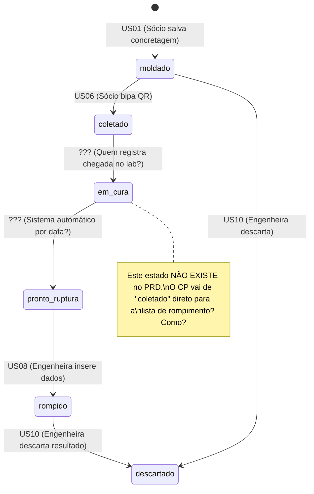

# 📋 Relatório de Revisão Crítica — PRD MVP Laboratório de Concreto

> **Data:** 02/06/2026  
> **Documento Revisado:** [PRD_MVP.md](file:///c:/Users/rickt/OneDrive/Desktop/Criação de app/PRD_MVP.md)  
> **Documentos de Apoio:** [MEMORIA_PROJETO.md](file:///c:/Users/rickt/OneDrive/Desktop/Criação de app/MEMORIA_PROJETO.md), [roteiro_entrevista_laboratorio.md](file:///c:/Users/rickt/OneDrive/Desktop/Criação de app/roteiro_entrevista_laboratorio.md), [implementation_plan.md](file:///c:/Users/rickt/OneDrive/Desktop/Criação de app/implementation_plan.md)

---

## 🔴 Gaps Críticos

Estes são furos no escopo que **travarão o desenvolvimento** ou gerarão retrabalho imediato caso não sejam resolvidos antes da sprint 1.

---

### 1. Ausência Total de Critérios de Aceite (Acceptance Criteria)

> [!CAUTION]
> Nenhuma das 19 User Stories possui critérios de aceite definidos. Isso é o gap mais grave do documento inteiro.

Sem critérios de aceite, o desenvolvedor não sabe *quando* a história está "pronta" e o QA não tem base para escrever testes. Exemplos do que está faltando:

| User Story | Critério de Aceite que DEVE existir |
|---|---|
| **US01** (OCR) | Dado que o sócio tira uma foto da NF, quando o OCR processa, então os campos `nf_numero`, `fck`, `volume_m3`, `concreteira` e `data` devem ser preenchidos automaticamente. Se *qualquer* campo retornar vazio ou com confiança < X%, o campo deve ser destacado em amarelo para revisão manual. |
| **US03** (Bluetooth) | Dado que a concretagem foi salva com sucesso, quando o sócio clica em "Gerar Etiquetas", então 4 etiquetas devem ser enviadas à impressora em sequência. Cada etiqueta deve conter: QR Code (com `codigo_rastreio`), Sigla da Obra, Data de Moldagem, Idade Alvo (7d ou 28d) e ID legível. |
| **US08** (Cálculo MPa) | Dado que a engenheira insere Diâmetro=150mm, Altura=300mm, Carga=23562 kgf, então o sistema deve exibir: Área = 17671.46 mm², MPa = 13.08 (usando fórmula `(Carga * 9.80665) / (π * d²/4) / 1000000`). Tolerância de arredondamento: 2 casas decimais. |
| **US14** (PDF) | Dado que todos os CPs de 28d foram rompidos, quando o engenheiro clica em "Gerar Laudo Final", então um PDF deve ser gerado contendo: cabeçalho com logo, tabela de resultados, gráfico de resistência, QR Code no rodapé, e permissões de `ReadOnly=true, AllowPrinting=true, AllowCopy=false`. |
| **US05** (Agenda) | Dado que um CP foi moldado há exatamente 24h, quando o sócio abre a Agenda de Coletas, então o CP deve aparecer na lista. CPs moldados há < 24h NÃO devem aparecer. |

**Ação Necessária:** Adicionar Acceptance Criteria no formato `Dado/Quando/Então` para **todas** as 19 User Stories.

---

### 2. Modelo de Permissões (RBAC) Indefinido

> [!CAUTION]
> O PRD define 4 roles (`socio_campo`, `eng_lab`, `eng_escritorio`, `cliente`) mas NÃO especifica a matriz de permissões.

Perguntas sem resposta que vão travar a implementação do Supabase RLS:

- O `socio_campo` pode ver dados de TODOS os clientes ou só os dele?
- O `eng_escritorio` pode descartar CPs (US10) ou só a engenheira de lab?
- Quem pode fazer upload do PDF assinado (US15)? Só `eng_lab` ou `eng_escritorio` também?
- O `cliente` vê laudos de todas as suas obras ou precisa filtrar por obra?
- Se um novo `socio_campo` for contratado, quem cria a conta dele? Só `admin`?

**Ação Necessária:** Criar uma **Matriz de Permissões RBAC** (Role × Recurso × Ação) antes de modelar as políticas RLS do Supabase.

---

### 3. Audit Trail (Rastreabilidade) Completamente Ausente

> [!CAUTION]
> Para um laboratório que emite laudos com validade técnica e jurídica (CREA), a ausência de audit trail é um risco regulatório grave.

O PRD permite edição de concretagens (US12b) e descarte de CPs (US10), mas **não define rastreabilidade alguma**. Problemas:

- Se o engenheiro de escritório edita um `fck` de 30 para 25 MPa (US12b), **quem fez isso e quando?**
- Se a engenheira descarta um CP (US10), **o laudo final reflete isso?** **Há registro do motivo?**
- Se um laudo é emitido e depois corrigido, **existe versionamento?** O laudo original é preservado?
- A página pública de validação (US19) mostra qual versão do laudo?

**Ação Necessária:** Definir uma política de Audit Trail:
1. Tabela `audit_log` com: `user_id`, `action`, `table_name`, `record_id`, `old_value`, `new_value`, `timestamp`.
2. Regra: **Todo UPDATE e DELETE em tabelas críticas** (`concretagens`, `rupturas`, `laudos`, `corpos_prova`) deve gerar um registro de auditoria.
3. Definir se o descarte de CP (US10) exige campo de `motivo_descarte` obrigatório.

---

### 4. Máquina de Estados dos CPs e Laudos Não Definida

O PRD menciona estados (`moldado | coletado | rompido` para CPs e `rascunho | pronto_assinatura | assinado` para laudos) mas **não define as transições válidas nem quem pode executá-las**.



**Gaps identificados:**
- **Estado `descartado`**: existe no PRD (US10) mas não no modelo de dados. O campo `status` da tabela `corpos_prova` não o prevê.
- **Transição `coletado` → `pronto para rompimento`**: quem/o quê dispara? É automático por data (`data_moldagem + idade_alvo_dias`)? Isso precisa estar explícito.
- **Laudo `pronto_assinatura` → `assinado`**: o que impede que o laudo seja marcado como assinado sem upload do PDF? Deve ser validado.

**Ação Necessária:** Documentar a máquina de estados completa para CPs e Laudos, incluindo transições, atores e guardas (condições).

---

### 5. Referência a Normas Técnicas Incompleta

> [!IMPORTANT]
> O PRD menciona apenas a NBR 5739 (tipo de fratura). Para um laboratório de ensaios de concreto, há um ecossistema normativo obrigatório que impacta diretamente os requisitos do sistema.

| Norma | Impacto no Sistema | Coberta no PRD? |
|---|---|---|
| **NBR 5738** – Moldagem e cura de CPs | Define *quantos* CPs por idade, *como* moldar, tempos mínimos de cura | ❌ Não |
| **NBR 5739** – Ensaio de compressão | Tipos de fratura, cálculo de resistência, tolerâncias | ✅ Parcial (apenas tipo de fratura) |
| **NBR 12655** – Preparo, controle e recebimento do concreto | Define critérios de aceitação do lote (fck estimado, desvio-padrão, amostragem) | ❌ Não |
| **NBR 7584** – Avaliação da dureza superficial (esclerometria) | Pode ser escopo futuro, mas o sistema precisa ser extensível | ❌ Não |
| **NBR NM 67** – Slump Test | O PRD menciona slump mas não define faixa aceitável nem validação | ❌ Não |

**Ação Necessária:** Validar com a engenheira quais normas o laudo emitido pelo sistema precisa referenciar, e se o cálculo do `fck estimado` (NBR 12655) precisa ser feito pelo sistema ou é responsabilidade do engenheiro.

---

### 6. Fórmula de Conversão kgf → MPa Não Especificada

O PRD diz que "o app calcula MPa automaticamente" mas **não documenta a fórmula exata com unidades**. Isso é crítico porque um erro de unidade gera laudos inválidos.

A conversão correta é:
```
MPa = (Carga_kgf × 9.80665) / (π × (diâmetro_mm/2)² ) × (1/1000000)
     = (Carga_kgf × 9.80665) / (π × d² / 4) / 10⁶
```

Mas note: se o diâmetro for inserido em **cm** por engano, o resultado será 100× maior. 

**Ação Necessária:** Documentar no PRD:
1. A fórmula exata com unidades de entrada e saída.
2. Validação de faixa: Diâmetro esperado (100–160 mm), Altura (200–320 mm), Carga (> 0 kgf).
3. Regra de arredondamento (1 ou 2 casas decimals de MPa).

---

### 7. Cadastro de Obras Ausente nas User Stories

O modelo de dados tem a tabela `OBRAS`, a impressão de etiquetas exige `Sigla da Obra`, mas **nenhuma User Story cobre o CRUD de obras**. Quem cadastra uma obra? Onde? Quando?

**Ação Necessária:** Adicionar User Stories para:
- Cadastro de obra (nome, sigla, localização GPS, cliente vinculado).
- Definir se o sócio pode criar obras em campo ou se isso é feito previamente pelo escritório.

---

## 🟡 Pontos de Atenção & Edge Cases

Cenários de exceção e requisitos não-funcionais que precisam ser detalhados para evitar surpresas no desenvolvimento.

---

### 1. OCR — Cenários de Falha Não Cobertos

| Cenário | Risco | Sugestão |
|---|---|---|
| Foto escura, borrada ou cortada | IA retorna campos parciais ou incorretos | Implementar preview da foto antes de enviar, com opção de refazer. |
| NF com layout nunca visto | Campos essenciais não reconhecidos | Definir quais campos são **obrigatórios** (NF nº, fck, volume) vs. opcionais. Se um obrigatório estiver vazio, bloquear o salvar e forçar preenchimento manual. |
| Timeout da API OpenAI (>15s) | Usuário em campo sem feedback | Definir timeout (ex: 10s), exibir mensagem "Não foi possível processar. Preencha manualmente." e logar o erro. |
| Custo por chamada da API | Sem controle, um uso excessivo pode gerar custos inesperados | Definir rate limiting (ex: máx. 3 tentativas de OCR por concretagem). |

---

### 2. Bluetooth — Edge Cases de Impressão

| Cenário | Risco | Sugestão |
|---|---|---|
| Impressora desligada ou sem papel | Comando enviado mas nada imprime | Implementar feedback de status da conexão BT (conectada/desconectada). Timeout de 5s para falha de impressão. |
| Impressão de apenas 2 de 4 etiquetas (perda de conexão no meio) | Etiquetas parciais, sócio não sabe quais foram impressas | Exibir checklist visual das 4 etiquetas com status individual (✅ impressa / ❌ falhou / 🔄 pendente). |
| Pareamento com impressora errada | Dados sensíveis impressos em dispositivo incorreto | Implementar tela de seleção/confirmação do dispositivo BT antes da impressão. |

---

### 3. Concorrência de Dados — Edição Simultânea

- **US12b** permite que o engenheiro de escritório edite concretagens. Mas e se o sócio ainda estiver editando a mesma concretagem no mobile?
- **Dois engenheiros** abrindo o mesmo laudo para edição simultânea?

**Sugestão:** Para o MVP, implementar **optimistic locking** simples: campo `updated_at` na tabela, e ao salvar, verificar se `updated_at` mudou desde a leitura. Se sim, exibir "Dados foram alterados por outro usuário. Recarregue a página."

---

### 4. LGPD e Segurança de Dados — Omissão Total

> [!WARNING]
> O PRD não menciona LGPD em nenhum momento. Para um sistema B2B que armazena dados de clientes (CNPJ, email, nomes), fotos com geolocalização e laudos técnicos, isso é obrigatório.

**Itens mínimos a definir:**

| Requisito LGPD | Status no PRD |
|---|---|
| Política de retenção de dados (por quanto tempo dados ficam no Supabase?) | ❌ Não definido |
| Quem é o controlador vs. operador dos dados? | ❌ Não definido |
| Consentimento para coleta de geolocalização nas fotos | ❌ Não definido |
| Direito de exclusão — cliente pode pedir remoção dos dados? | ❌ Não definido |
| Criptografia em trânsito (HTTPS) e em repouso | ❌ Não definido (Supabase oferece, mas precisa ser explícito) |

---

### 5. Foto com Marca d'Água — Detalhes Técnicos Ausentes

O [roteiro_entrevista_laboratorio.md](file:///c:/Users/rickt/OneDrive/Desktop/Criação de app/roteiro_entrevista_laboratorio.md) menciona marca d'água nas fotos (data, horário, cidade, GPS), mas o PRD **não inclui isso**. Definir:

- A marca d'água é aplicada no client (antes do upload) ou no server (Edge Function)?
- É um overlay de texto translúcido na imagem ou metadados EXIF?
- A geolocalização exige permissão do dispositivo — o que acontece se o usuário negar?

---

### 6. Número Variável de CPs por Concretagem

O PRD assume **fixo em 4 CPs** (2×7d + 2×28d), mas o roteiro de entrevista menciona campos manuais incluindo "nº de CPs (padrão 4)". 

- Se a engenheira quiser moldar 6 CPs (2×3d + 2×7d + 2×28d), o sistema suporta?
- As idades-alvo são apenas 7d e 28d ou podem variar (3d, 14d, 63d, 91d)?
- Isso impacta diretamente a lógica de geração de etiquetas e de laudos.

---

### 7. Laudo Parcial vs. Final — Lógica de Geração Ambígua

A US13 menciona "Laudo Parcial (7 dias) e Laudo Final (28 dias)" mas:

- O laudo parcial é gerado automaticamente quando os 2 CPs de 7d são rompidos? Ou precisa de ação manual?
- Se um CP de 7d for descartado (US10), o laudo parcial fica com apenas 1 resultado? É válido?
- O laudo final de 28d inclui os resultados de 7d ou apenas os de 28d?
- Se o cliente não quiser laudo parcial, há opção de desativar?

---

### 8. Validação de Limites de Engenharia

O PRD não define **limites de validação** para inputs críticos:

| Campo | Faixa Razoável | O que acontece se fora da faixa? |
|---|---|---|
| Slump (mm) | 0–260 | Warning? Bloqueio? |
| fck (MPa) | 10–100 | Warning? |
| Diâmetro CP (mm) | 100–160 | Erro? O cálculo de MPa será errado. |
| Altura CP (mm) | 200–320 | Erro? |
| Carga ruptura (kgf) | 1.000–100.000 | Verificar se digitou em kN por engano? |
| Volume m³ | 0.1–20 | Warning? |

---

## 🟢 Oportunidades de Melhoria

Sugestões que não são bloqueantes mas elevariam significativamente a qualidade do produto.

---

### 1. Dashboard Operacional (Home do Web)

O PRD vai direto para User Stories operacionais mas não prevê uma **tela inicial com visão geral**:
- Total de CPs moldados / coletados / rompidos hoje/semana.
- Laudos pendentes de assinatura (contador).
- Concretagens sem coleta > 24h (alerta).
- Próximos rompimentos programados.

Isso muda a percepção de valor do sistema de "um formulário digital" para "um painel de controle inteligente".

---

### 2. UX da Tela de Prensa — Fluxo Sequencial

Em vez de exibir **todos os campos de uma vez** (peso, diâmetro, altura, carga), considerar um fluxo **wizard/step-by-step** que espelha o processo físico:

1. **Passo 1:** Bipar QR Code → Identifica CP.
2. **Passo 2:** Pesar → Input de Peso (g) com teclado numérico.
3. **Passo 3:** Medir → Inputs de Diâmetro e Altura.
4. **Passo 4:** Romper → Input de Carga + Seleção de Fratura + Fotos.
5. **Resumo:** Exibe MPa calculado, pede confirmação.

Isso reduz erros e é mais ergonômico com luvas.

---

### 3. Notificações por E-mail — Especificação de Gatilhos

A US24 menciona e-mail em vez de push, mas **quais e-mails** serão enviados?

| Gatilho | Destinatário | Conteúdo |
|---|---|---|
| Laudo assinado e publicado | Cliente | "Seu laudo está disponível para download." |
| CP atrasado (>24h sem coleta) | Sócio de campo | "Existem X CPs pendentes de coleta." |
| Laudo pronto para assinatura | Engenheira (RT) | "X laudos aguardam sua assinatura." |
| Novo cliente cadastrado | Cliente | "Bem-vindo! Acesse o portal em [link]." |

---

### 4. Exportação Excel — Especificação do Relatório

O roteiro menciona "Exportação consolidada em Excel" para análise de concreteiras, mas o PRD não define:
- Quais colunas?
- Filtros disponíveis (data, concreteira, fck alvo, obra)?
- É um botão no painel web ou um relatório agendado?

---

### 5. Versionamento de Laudos

Quando um laudo é corrigido (ex: erro de digitação no fck que altera o resultado), o sistema deveria:
- Manter o **laudo original** com status `superseded`.
- Gerar um **novo laudo** com número de versão incrementado.
- A página pública (US19) sempre mostra a **versão mais recente**.

---

### 6. Backup e Recuperação de Dados

O PRD não define estratégia de backup. Supabase oferece backups diários no plano Pro, mas:
- O que acontece se o bucket do Storage (fotos, PDFs) for corrompido?
- Existe plano de disaster recovery?
- Quanto tempo de dados pode ser perdido (RPO)?

---

## ❓ Perguntas para Validação com a Engenheira

Perguntas diretas e técnicas para fechar as pontas soltas antes do "ok" final.

---

### Fluxo Operacional

1. **Quantos CPs são moldados por concretagem como padrão?** Sempre 4 (2×7d + 2×28d)? Ou pode variar? Existem outras idades de rompimento (3d, 14d, 63d)?

2. **O slump test tem faixa de tolerância por fck?** Ex: para fck 30, o slump aceitável é 100±20mm? O sistema deve validar isso ou o sócio decide em campo?

3. **Quando o CP chega ao laboratório após a coleta, ele passa por algum registro de entrada?** Ou a coleta (US06) já é suficiente para rastrear que ele está no tanque de cura?

4. **Como funciona a "fila" de rompimento na prensa?** A engenheira rompe na ordem da lista ou escolhe aleatoriamente? Os CPs de clientes diferentes são misturados no mesmo dia?

5. **Se todos os CPs de uma idade forem descartados (ex: 2 CPs de 7d descartados), o que acontece com o laudo parcial?** Ele simplesmente não é emitido?

### Cálculos e Normas

6. **A fórmula de MPa no laudo utiliza `d²` do diâmetro nominal (150mm padrão) ou do diâmetro medido real?** Isso muda o resultado.

7. **O laudo exige cálculo de fck estimado (fck,est) conforme NBR 12655?** Ou apenas a média de MPa dos CPs é suficiente para o tipo de cliente que vocês atendem?

8. **Quais tipos de fratura (NBR 5739) são registrados?** A lista completa é: Cônica, Cônica e Split, Cisalhamento, Colunar e Fenda. Está correto?

9. **Existe fator de correção por relação altura/diâmetro (h/d)?** Para CPs com h/d diferente de 2, a norma exige fator de correção.

10. **O arredondamento do MPa no laudo é de 1 ou 2 casas decimais?**

### Laudos e Documentação

11. **O laudo precisa ter número sequencial controlado?** Ex: "Laudo nº 2026/0147". Se sim, quem controla essa numeração?

12. **Qual informação EXATA aparece no laudo PDF?** Peça um laudo atual (Excel/PDF) como referência de layout para o desenvolvedor.

13. **O laudo parcial (7d) é um documento independente ou apenas um relatório interno?** Ele também precisa de assinatura gov.br?

14. **Quando um laudo é corrigido/retificado, o que acontece com a versão anterior?** Ela precisa ficar acessível para auditoria?

15. **O gráfico de resistência no laudo mostra apenas os CPs da concretagem atual ou um comparativo com o fck de projeto?**

### Operações e Permissões

16. **Quem pode cadastrar novos usuários no sistema?** Apenas um admin? A engenheira pode?

17. **O sócio de campo pode criar uma nova obra diretamente no app mobile, ou isso precisa ser feito previamente pelo escritório?**

18. **A engenheira de laboratório e o engenheiro de escritório podem fazer login tanto no mobile quanto no web, ou cada perfil é restrito a uma plataforma?**

19. **Existe mais de um sócio de campo?** O sistema precisa suportar múltiplos coletores simultâneos?

20. **Se a engenheira sair de férias, outra pessoa pode assinar os laudos?** O sistema precisa suportar múltiplos responsáveis técnicos (RT)?

### Segurança e Conformidade

21. **Vocês possuem certificação ISO 9001 ou estão em processo?** Isso define o nível de rigor do audit trail necessário.

22. **Por quanto tempo os laudos e dados de ensaio precisam ser armazenados?** A ABNT ou o CREA define prazo mínimo de retenção?

23. **O laboratório atende a alguma exigência específica de certificação ou acreditação (ex: INMETRO, ABNT NBR ISO/IEC 17025)?** Isso pode exigir funcionalidades adicionais de rastreabilidade.

24. **As fotos de evidência (antes/depois do rompimento) são obrigatórias para todos os CPs ou apenas para os casos de disputa?**

25. **O QR Code de validação pública do laudo (US19) precisa mostrar TODOS os dados do laudo (incluindo MPa) ou apenas confirmação de "laudo autêntico" + dados básicos (nº, data, cliente)?** Exibir MPa publicamente pode ser um risco de exposição de dados do cliente.
