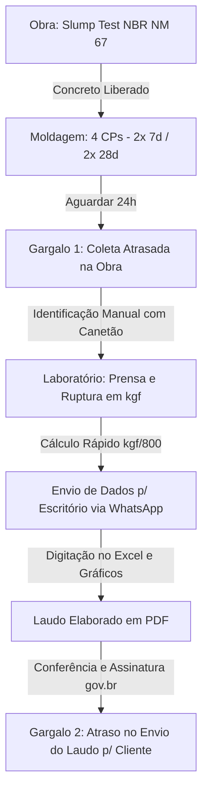

# Roteiro de Entrevista e Requisitos do MVP: App para Laboratório de Ensaios de Concreto

## 📄 Contexto do Projeto e Objetivo

Este documento consolida o mapeamento do fluxo operacional do laboratório, os papéis da equipe, os gargalos identificados e a especificação de requisitos para o MVP (Produto Mínimo Viável) com base nas definições da engenheira responsável.

---

## 👥 Personas e Papéis da Equipe

1. **Engenheira de Laboratório (Responsável Técnica/CREA):**
   * Realiza os rompimentos na prensa no período da tarde.
   * Faz visitas técnicas e inspeções nas obras.
   * Confere os laudos elaborados, assina digitalmente via gov.br (PDF) e realiza a entrega aos clientes.
2. **Sócio de Campo:**
   * Atua na coleta e moldagem dos corpos de prova (CPs) em campo.
   * Realiza o ensaio de abatimento (Slump Test) para liberação do concreto na obra.
3. **Engenheiro de Escritório:**
   * Recebe as informações de concretagem coletadas em campo.
   * Cadastra os dados no sistema, monta os laudos, insere os resultados de ruptura e gera os gráficos de crescimento de resistência.

---

## 🔍 Mapeamento do Fluxo Operacional e Gargalos

### Gargalos Mapeados:
1. **Atraso na Coleta de 24h:** CPs passam do tempo limite na obra devido à agenda lotada, perdendo resistência de cura.
2. **Rastreabilidade Falha na Obra:** Identificação a canetão com dados manuais rápidos e ordem aleatória sem rastreabilidade de data.
3. **Transcrição de Nota Fiscal (NF):** O engenheiro do escritório precisa digitar manualmente os dados extraídos da foto da NF para a planilha Excel.
4. **Segurança do Laudo PDF:** Risco jurídico caso o cliente altere os resultados de MPa para burlar fiscalizações.
5. **Gargalo de Entrega de Laudos:** Os laudos ficam travados aguardando a assinatura digital (gov.br) e o envio manual via WhatsApp pela engenheira, que está ocupada em campo.

---

## 🚀 Escopo do MVP (Requisitos Definidos)

1. **OCR / Leitura Inteligente da Nota Fiscal (Foto):**
   * O Sócio tira foto da NF em campo. O app realiza a leitura automática de texto (OCR).
   * **Tarcal (Cliente Fixo):** Layout de NF padronizado para alta precisão.
   * **Outros Clientes:** Layout variável com mapeamento dos campos essenciais (número da NF, data, volume, fck, concreteira).
2. **Impressão de Etiquetas QR Code em Campo (Bluetooth):**
   * Vinculação da etiqueta adesiva com QR Code diretamente à NF cadastrada.
   * Impressão realizada em tempo real pelo sócio na obra utilizando uma **impressora térmica portátil Bluetooth**.
   * As etiquetas devem ser resistentes à água (submersão em tanques de cura por até 28 dias).
3. **Geração Automática de Agenda Diária Unificada (Fim do Dia):**
   * O sistema gera diariamente as tarefas para o dia seguinte:
     * **Campo (Sócio/Engenheira):** Rota de coletas programadas (CPs que completaram 24h de moldagem).
     * **Lab (Engenheira):** CPs de todos os clientes (Tarcal + demais) para rompimento de 7d ou 28d.
4. **Coleta e Cálculo na Prensa (Prensa Mobile):**
   * **Entrada de Dados:** A engenheira insere no app a carga de ruptura (kgf), o peso e as **dimensões reais** (diâmetro e altura medidos com paquímetro) para cálculo exato.
   * **Fórmula do MPa:** O app calcula a área real ($\pi \cdot d^2 / 4$) e converte a força para MPa automaticamente.
   * **Classificação de Ruptura (NBR 5739):** O app exibe um guia visual simples (ícones/desenhos) para a engenheira classificar o tipo de fratura do CP rompido.
   * **Ergonomia:** Interface com botões grandes de fácil acionamento na prensa.
   * **Sem suporte Offline:** O app funcionará sempre conectado (não há necessidade de modo offline).
5. **Registro Fotográfico de Evidência:**
   * Marca d'água na foto contendo: data, horário, cidade e geolocalização.
   * **Fotos no Laudo:** As fotos (Antes/Depois) não aparecem no laudo PDF padrão do cliente. Elas são armazenadas na nuvem e agrupadas em um **laudo técnico secundário** (anexo de evidência) para uso exclusivo em auditorias (ISO 9001/disputas).
6. **Segurança do PDF e Assinatura Digital (Anti-Fraude):**
   * **Assinatura Gov.br:** Assinatura digital padrão PAdES via gov.br realizada pela engenheira, que invalida o PDF se alterado.
   * **QR Code de Autenticidade:** Link público no rodapé para verificação dos dados originais gravados no banco de dados do laboratório.
   * **Bloqueio de PDF:** Geração com permissões de somente-leitura e bloqueio contra edições.
7. **Portal do Cliente (Self-Service):**
   * Central de download onde o cliente acessa os laudos validados, eliminando a dependência do envio individual por WhatsApp.

---

## 📈 Requisitos de Escala Comercial, Relatórios e SaaS

1. **Laudo Pré-Pronto (Killer Feature):**
   * O maior diferencial do sistema é a geração instantânea do rascunho do laudo logo após os rompimentos, restando apenas a conferência final pela engenheira. Os laudos devem ser limpos, com gráficos fáceis de interpretar e design moderno.
2. **Exportação consolidada em Excel (Análise de Parcerias):**
   * Exportação de um relatório consolidado mensal em Excel que agrupa e compara os resultados dos CPs de diferentes clientes baseando-se na concreteira fornecedora e no MPa alvo (ex: comparativo de qualidade do concreto Fck 30 MPa de diferentes fornecedores no mês).
3. **Padrão de Layout do Laudo:**
   * Layout único e padronizado em PDF para todos os clientes, variando apenas o logotipo do laboratório e os resultados de resistência específicos, sem necessidade de customização avançada de layout para o MVP.
4. **Integração de Hardware (Balança/Prensa Bluetooth):**
   * Colocada no backlog técnico do projeto. No MVP, a digitação manual de peso e carga no celular atende perfeitamente à demanda, visto o custo proibitivo de trocar/adaptar os maquinários físicos atuais do laboratório.
